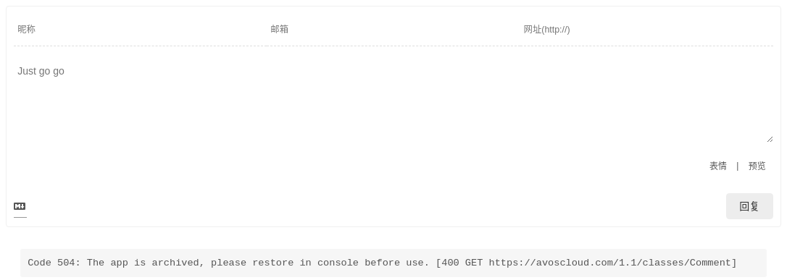
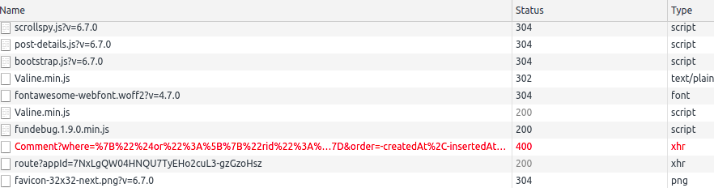
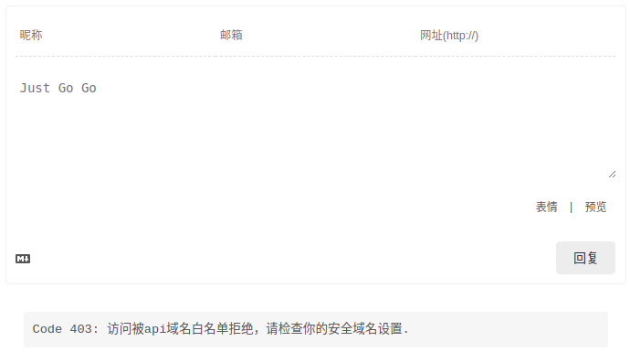
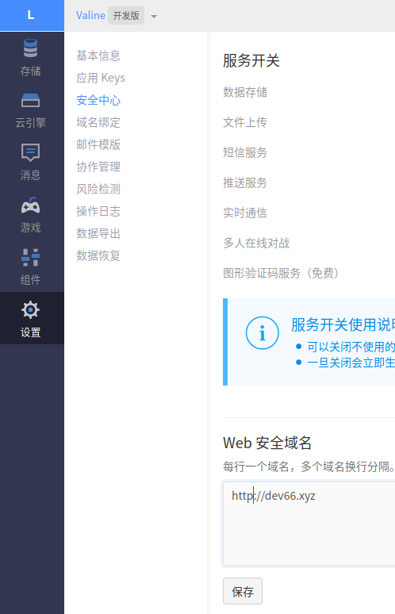

用Valine作为静态博客的社会化评论插件。但今天用的时候，发现一些错误信息，将解决方案写于此。

<!--more--> 

[Valine](https://valine.js.org/)是一款基于LeanCloud的静态博客社会化评论插件。基于以下几个原因，暂时使用该插件支持评论功能：

1. 鉴于国内社会化评论插件已经死得七七八八，国外的则纷纷被墙，Valine还能用
2. Valine之所以能用的原因是开源，自己搭环境，没有墙的风险
3. Valine基于LeanCloud，不想付费的话，可以一直免费（当然这样其实很不好，开发人应该心疼开发人）

唯一担心的是：Valine能用多久，全看LeanCloud能活多久。这两天更新博客，就发现一些LeanCloud导致的问题

## 问题1，400错误

在留言框下侧出现400错误提示



浏览器中查看具体调用的response后，发现Valine调用LeanCloud失败



具体失败原因是LeanCloud上创建的免费app已经被archive了。估计LeanCloud有个机制，将长期免费使用且不活跃的应用archive，以节省资源。

```js
{"code":504,"error":"The app is archived, please restore in console before use."}
```

解决方案就是登录LeanCloud重新激活应用。但是的确没有找到禁止archive的开关。

## 问题2，白名单问题

解决问题1后，发现依旧有问题无法使用Valine



具体失败原因是

```js
{"code":403,"error":"Access denied by api domain white list.The request origin header is 'https:\/\/dev66.xyz'."}
```

这个是因为最近将博客从http改为https，而LeanCloud之前设置的白名单是http的，如下：



将`https://dev66.xyz` 加入白名单后，即恢复正常。

## 最后的flag

眼瞅着国内云平台大局已定，小公有云厂商分分钟钟挂掉的节奏。LeanCloud一完，所有内容就灰飞烟灭了。给2020年立个flag，争取帮Valine适配一家其他云平台的API，或者自己做一个社会化插件。


