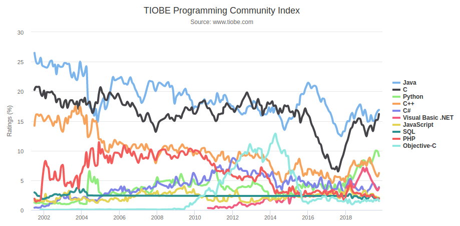

九月份，C# 8.0作为.Net Core 3.0的一部分正式发布了。本文会基于Ubuntu 18.04上的.Net Core 3.0介绍C# 8.0的各种新功能。

<!--more--> 

刚毕业时用了差不多5年C/C++，之后一口气折腾了七八年C#。论语言优雅和开发效率，C#比Java先进了不少。那时候每次看到TIOBE，VB.Net加C#的rating稳步提升，Java逐步降低，就会开心得不得了（为站对了队而开心？）。可惜由于.Net出身问题，一直在很封闭的圈子里发展，甚是缓慢。.Net份额始终没过10%。有一阵子在上海一家用.Net做开发的互联网公司工作。放眼望去，除了东家，上海只有携程还在成规模的用.Net，人才甚是难招。没多久，携程也投奔了Java，上海.Net环境更加恶劣了。等我离开前东家没一年，就听说前东家也全面转Java。

虽然这几年微软拥抱Linux，拥抱开源，.Net Core越来越给力。但无奈Python/Javascript/Go异军突起，抢了.Net和PHP的大量份额（貌似Java反而受影响很小），.Net份额已经跌到了7%。



然而对一个人、一件事、一个物的真爱又怎会随潮流和时间而变？平时依旧会关注.Net的发展。九月份，C# 8.0作为.Net Core 3.0的一部分正式发布了。本文会基于Ubuntu 18.04上的.Net Core 3.0介绍`C# 8.0](https://docs.microsoft.com/en-us/dotnet/csharp/whats-new/csharp-8)各种新功能。

## 安装.Net Core 3.0

在Ubuntu 18.04上安装[.Net Core Runtime](https://dotnet.microsoft.com/download/linux-package-manager/ubuntu18-04/runtime-3.0.0)和[.Net SDK](https://dotnet.microsoft.com/download/linux-package-manager/ubuntu18-04/sdk-3.0.100)

```bash-session
$ wget -q https://packages.microsoft.com/config/ubuntu/18.04/packages-microsoft-prod.deb -O packages-microsoft-prod.deb
$ sudo dpkg -i packages-microsoft-prod.deb
(Reading database ... 269274 files and directories currently installed.)
Preparing to unpack packages-microsoft-prod.deb ...
Unpacking packages-microsoft-prod (1.0-ubuntu18.04.2) over (1.0-ubuntu18.04.2) ...
Setting up packages-microsoft-prod (1.0-ubuntu18.04.2) ...
------------------------------------------------------------

$ sudo add-apt-repository universe
$ sudo apt-get update
$ sudo apt-get install apt-transport-https
$ sudo apt-get update
$ sudo apt-get install aspnetcore-runtime-3.0
$ sudo apt-get install dotnet-sdk-3.0
```

## 新特性 C# 8.0

本文例子均是基于[C# 8.0](https://docs.microsoft.com/en-us/dotnet/csharp/whats-new/csharp-8)，增加一些个人的理解。

### 1. readonly member

如果struct结构中的成员方法（属性）只用于 **读**，则增加`readonly`关键字，以帮助编译器理解设计意图，利于优化。

```csharp
public struct Point
{
    public double X { get; set; }
    public double Y { get; set; }
    public readonly double Distance => Math.Sqrt(X * X + Y * Y);
    public readonly override string ToString() =>
        $"({X}, {Y}) is {Distance} from the origin";
}
```

:csharp:`ToString`方法不会改变Point结构中的任何状态，是一个只读方法，故可以用`readonly`进行修饰。但是 :csharp:`ToString`方法中引用了 :csharp:`Dispose`方法。如果 :csharp:`Dispose`不用`readonly`修饰，编译器会给出警告`warning CS8656: Call to non-readonly member 'Point.Distance.get' from a 'readonly' member results in an implicit copy of 'this'`。因此要在Distance方法前也加上`readonly`关键词。

```csharp
public readonly void Translate(int xOffset, int yOffset)
{
    X += xOffset;
    Y += yOffset;
}
```

如果在Point结构中增加上述方法，编译时会报错`error CS1604: Cannot assign to 'X' because it is read-only`。由于方法用`readonly`关键字进行了修饰，故编译器会检查方法内是否改变了结构状态。

### 2. Default interface methods

如果我们基于一个已经存在的interface实现了若干类。当我们给interface增加一个新方法时，就不得不修改每一个已经存在的类，实现这个新接口方法。有了default interface methods之后，给interface添加新接口方法的同时，可以提供一个默认实现。所有已经存在的类对应的接口方法都使用该默认实现，而无需做代码调整。举个例子：

```csharp
public interface IOld 
{
    decimal GetZero();
}

public class OldImpl : IOld
{
    public decimal GetZero() 
    {
        return 0;
    }
}

var old = new OldImpl();
Console.WriteLine($"Result: {old.GetZero()}");
```

现在需要给IOld接口增加一个GetOne接口方法，但是并不想修改OldImpl类。这时候就需要用到default interface methods这个功能。

```csharp
public interface IOld 
{
    decimal GetZero();
    public decimal GetOne() => DefaultGetOne(this);
    protected static decimal DefaultGetOne(IOld old)
    {
        return 1;
    }
}

var old = new OldImpl() as IOld;
Console.WriteLine($"Result 0: {old.GetZero()}, Result 1: {old.GetOne()}");    
```

需要注意几点：

- IOld新增接口 :csharp:`GetOne`方法，而OldImpl类无需修改
- 在IOld实现了一个静态函数 :csharp:`DefaultGetOne`是为了方便实现类调用默认的实现。接口中的default interface method也是调用该静态方法
- 因为OldImpl里并没有 :csharp:`GetOne`方法，所以需要把 :csharp:`new OldImpl()`强制转换为接口IOld使用 :csharp:`GetOne`方法

新的类OldImpl2可以实现自己的 :csharp:`GetOne`逻辑

```csharp
public class OldImpl2 : IOld
{
    public decimal GetZero() 
    {
        return 0;
    }

    public decimal GetOne() 
    {
        return this.GetZero() == 0 ? IOld.DefaultGetOne(this) : -1;
    }        
}
```

### 3. More patterns in more places

简单说，这是更牛逼的语法糖，帮我们把代码写得更简洁更直观。 这个新功能主要包含两部分： 1. 更丰富的Pattern matching；2. 和recursive patterns，pattern包含pattern。

#### 3.1 switch expressions

官网上有一个很精彩的例子讲解[switch expressions](https://docs.microsoft.com/en-us/dotnet/csharp/tutorials/pattern-matching)。 这里给一个简单的例子：

```csharp
switch (a)
{
    case double:
        return "double";
    case 1:
        return "one";
    case 2:
        return "two";
    default:
        throw new ArgumentException("bad value");
}
```

用switch expression调整一下。注意这个表达式最终作为一个方法的返回值存在（方法就是那个 :csharp:`ConvertDecimalToLiteral`）

```csharp
public static string ConvertDecimalToLiteral(decimal a) 
    => a switch
    {
        double d => "double",
        1 => "one",
        2 => "two",
        _ => throw new ArgumentException("bad value")
    }
```

#### 3.2 Property patterns

在switch expressions中使用类实例的属性值。很简单：

```csharp
class Foo
{
    public int A;
}

public static string ConvertObjectPropertyToLiteral(Foo foo) 
    => foo switch
    {
        {A: 1} => "one",
        {A: 2} => "two",
        _ => "other"
    }
```

#### 3.3 Tuple patterns

也很简单，给个例子一目了然：

```csharp
public static string ConvertIntPairToLiteral(int i, int j)
    => (i, j) switch
    {
        (1, 1) => "dual one",
        (2, 2) => "dual two",
        (3, _) => "triple something",
        (_, _) => "the other"
    };
```

#### 3.4 Positional patterns

[Deconstruct](https://docs.microsoft.com/en-us/dotnet/csharp/deconstruct)是C# 7.0引入的新功能

假设类定义中包含 :csharp:`Deconstruct`方法，

```csharp
public class Foo
{
    public void Deconstruct(out int x, out int y) =>
        (x, y) = (1, 2);
}
```

则可以在switch expressions中这样使用positional pattern：

```csharp
public static string ConvertDeconstructToLiteral(Foo foo)
    => foo switch
    {
        (0, 0) => "zero",
        var (x, y) when x > 1 && y > 1 => "best",
        var (_, _) => "the other",
        _ => throw new ArgumentException("bad value")
    };
```

#### 4. using declarations

过去使用 :csharp:`using`要用花括号

```csharp
static void Foo()
{
    using (var file = new System.IO.StreamWriter("WriteLines2.txt"))
    {
        file.WriteLine("Hello World");
    }
}
```

8.0之后，无需再用花括号

```csharp
static void Foo()
{
    using var file = new System.IO.StreamWriter("WriteLines2.txt");
    file.WriteLine("Hello World");
    // file is disposed here
}
```

### 5. Static local functions

C# 7.0时，引入了local function用来更清晰的表达开发者意图，即这个函数仅供定义该函数的方法内使用，生人勿用！C# 8.0进一步升级，如果local function没用使用定义范围内的任何局部变量，则可以声明为static。

```csharp
static int Foo()
{
    int y;
    LocalFunction();
    int z = Add(0, 1);
    return y;

    void LocalFunction() => y = 0; // local functions
    static int Add(int left, int right) => left + right; // static local functions
}
```

### 6. Indices and ranges

在Python中有negative indexing和slicing的概念，如下：

```python
a = [1, 2, 3]
b = a[-1]
c = a[1:2]
```

现在C# 8.0也支持了

```csharp
var a = new decimal[] {1M, 2M, 3M};
var b = a[^1];
var c = a[1..2];
```

### 7. Asynchronous streams

假设有一个数据表提供了很多有规律的数字，且有一个支持分页的API可以遍历这个数据表中的数字。如何将表中的数字全部遍历出来？

```csharp
public async Task<IEnumerable<int>> GetNumbers(string apiUrl)
{
    var allResults = new List<int>();
    var nextUrl = apiUrl;
    while (nextUrl != null)
    {
        var page = await _client.GetAsync(nextUrl).Content.ReadAsAsync<int>();
        allResults.AddRange(page.Numbers);
        if (page.NextPage < page.TotalPages) 
        {
            nextUrl = apiUrl + "?page=" + page.NextPage;
        } 
        else
        {
            nextUrl = null;
        }
    }
    return allResults;
}
```

这段代码可以工作。如果把这个方法看做一个producer的话，那在所有页获取完毕之前，consumer端是无法开始消耗的。也就是说，尽管我们用了async/await试图并发处理，但实质上producer和consumer顺序完成，并没有任何速度提升。而有了async streams新特征之后，我们可以这样做：

```csharp
public async System.Collections.Generic.IAsyncEnumerable<int> GetNumbers(string apiUrl)
{
    var nextUrl = apiUrl;
    while (true)
    {
        var page = await _client.GetAsync(nextUrl)
                            .Content.ReadAsAsync<int>();
        foreach (var number in page.Numbers) 
        {
            yield return number;
        }

        if (page.NextPage < page.TotalPages) 
        {
            nextUrl = apiUrl + "?page=" + page.NextPage;
        }
        else
        {
            yield break;
        }
    }
}

await foreach (var number in GetNumbers(apiUrl))
{
    ProcessAync(number);
}
```

每一次API的等待过程，都可以同时异步处理上一次API的结果（ProcessAsync）。

### 8. 其他

除了以上几种新特性外，C# 8.0还支持：

- Disposable ref structs：ref struct因为不能boxing，故也不能实现接口，也就不能实现IDisposable接口，也就不能用using语法。然而有了Disposable ref structs特性，可以在ref struct中直接声明Dispose方法，从而和using配合。
- Nullable reference types：通过使用`?`给编译器传达更明确的意图，某个引用变量是否可以为null。
- Null-coalescing assignment：`??=`等价于`a == null ? 1 : a`。
- Unmanaged constructed types：如果结构体中所有成员都是unmanaged type，则这个结构体也为unmanaged type。
- stackalloc in nested expressions：可以在表达式中使用关键字 :csharp:`stackalloc`。