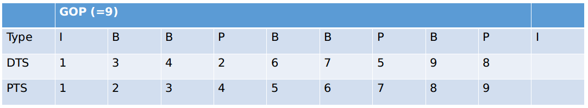

FFmpeg （Fast Forward Mpeg）是一个历史悠久，功能强大的跨平台多媒体处理工具。我会在这篇文章中介绍一些常见FFmpeg惯用法。也会结合FFmpeg的源代码对一些惯用法原理进行简单讲解。

<!--more--> 

网上记录FFmpeg使用的博客文章其实蛮多的。但是和大部分技术，特别是那些历史悠久的技术一样，很多内容都已经out of date，和最新版本有较大出入。如果想学习FFmpeg建议务必从以下几个官方维护的站点入手：

- [ffmpeg.org](https://ffmpeg.org/)官网
- [ffmpeg wiki](https://trac.ffmpeg.org/)官方wiki 
- [ffmpeg souce git](https://git.ffmpeg.org/ffmpeg.git)官方源代码仓库
- [ffmpeg github mirror](https://github.com/FFmpeg/FFmpeg)源代码在github上的镜像
- [ffmpeg awesome](https://github.com/transitive-bullshit/awesome-ffmpeg)ffmpeg的awesome，但和其他技术相比，内容少得可怜
- [雷霄骅CSDN博客](https://blog.csdn.net/leixiaohua1020)中国传媒大学一位音视频博士写的博客，内容十分丰富。不过很遗憾，天妒英才，"雷神"2016年26岁的时候猝死， [相关新闻](https://www.thepaper.cn/newsDetail_forward_1508232)
- [FFmpeg从入门到精通](https://blueblue233.github.io/categories/FFmpeg%E4%BB%8E%E5%85%A5%E9%97%A8%E5%88%B0%E7%B2%BE%E9%80%9A/)另一位博主写的FFmpeg系列博客
- [China ffmpeg论坛](http://bbs.chinaffmpeg.com/)一个讨论ffmpeg的中文论坛

整个文章分成两部分。第一部分：先介绍一些音视频（主要是视频）编解码的基础知识。尽管不了解这些内容，并不妨碍使用ffmpeg。

## 网络流媒体的解码全貌

下图转自[雷霄骅的博客](https://blog.csdn.net/leixiaohua1020/article/details/50534369)。

- `mp4`, `mkv`, `avi` 这些为封装格式，将音频，视频，字幕等各种媒体信息打包成一个文件，解封装和封装操作英文为 `demux` 和 `mux`。
- `h264`, `h265`, `aac` 为音视频编解码，将chunk data还原为一帧一帧的数据，英文为 `decode` 和 `encode`
- `yuv420`, `rgb24`, `pcm` 为每一帧的编解码，将每一帧还原可以被设备使用的数据

## I帧/P帧/B帧

图片压缩技术是利用“空间”相似度，即同一幅图片中各部分的相似度完成压缩。视频压缩技术，除了利用“空间”相似度，同时还充分利用“时间相似度”，即不同时刻帧之间的相似度来进行压缩。一般会有三种不同的视频帧：

- I frame (intra picture),无需其他帧即可还原成一张图像。基本上可以认为就是基于图像压缩技术的一帧
- P frame (predictive frame),参考前一帧（可以是I帧或者P帧）和当前帧信息还原出一张图像。
- B frame （bi-drectional interpolated prediction frame），从英文名称可以看出，该帧基于前后帧的信息及当前帧信息插值还原一张图像。

假设一段视频流中全都是I帧，则本质上这段视频流完全没有“时间”信息，由一组压缩好的图像组成。视频流的“体量”一定很大。如果视频流中同时包含I帧和P帧，那“体量”就会略小；同时所有帧按顺序解码即可，最多P帧要借用之前的I帧解码结果。但是如果视频流中还包含了B帧，当解码器遇到B帧时，就要先跳过去，直到解到下一个I或者P帧，再回过头来解中间的B帧。这意味着帧解码的顺序和最终播放的顺序是不一致的，因此就引出两个概念：

- PTS (Presenting Time Stamp)，帧播放时间戳
- DTS （Decoding Time Stamp），帧解码时间戳

两个I帧之间的区域称为GOP (Group of Pictures), 用下面的表格描述以上相关概念之间的关系：

根据以上信息，可以推出关于I/P/B帧的一些特性：

- I帧，P帧，B帧压缩比依次增高，但是解码消耗依次增大
- GOP设置得大，压缩比高，同样的码率，帧数会更多。但会有几个缺点：1） 导致编解码速度降低; 2） 同时当需要seek操作时，响应时间也会增加； 3） 一旦I帧有问题，就会导致整个GOP出现问题，对视频质量产生较大影响

## 帧率（framerate）和码率（bitrate）

帧率就是我们常说的 `fps` ，每秒钟播放多少帧。码率则是指每秒钟传输的数据量，一般用kbps或者Mbps作为单位，即每秒钟传输多少bit作为单位。码率会受到以下因素影响：

- 分辨率，如：1080p还是720p？越大的分辨率，码率越高
- 帧率，如:30fps, 24fps？帧率越大，码率越高
- GOP，如果GOP很大，说明流中有较多压缩比高的B和P帧，码率就会低一些；反之，说明有较多压缩比低的I帧，码率就随之升高
- 整个视频内容如果镜头切换多（如：动作片），编码器会强行加入更多的I帧，确保有较好的清晰度，从而导致码率变大

这部分基础知识先到这里。下一篇会开始介绍一些常见FFmpeg用法。

