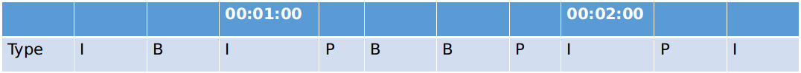

上一篇文章中，我们已经熟悉了FFmpeg相关的基本概念。这篇中，我们就介绍一些常见的FFmpeg用法，比如：格式转码，抽取关键帧，分段录制rtsp流等。

<!--more--> 

## 1. 解封装和编解码

将mov文件转为mp4文件

```bash-session
$ ffmpeg -i a.mov a.mp4
```

等同于使用`-f`参数指定输出媒体类型（封装格式）

```bash-session
$ ffmpeg -i a.move -f mp4 a.dat
```

`-f`支持的格式,可用如下命令获得:

```bash-session
$ ffmpeg -formats
ffmpeg version N-97037-gba698a23c6 Copyright (c) 2000-2020 the FFmpeg developers
built with gcc 7 (Ubuntu 7.5.0-3ubuntu1~18.04)
configuration: --prefix=/usr/local --enable-shared --disable-optimizations --disable-x86asm --enable-libx264 --enable-gpl --disable-stripping --enable-debug=3 --extra-cflags=-gstabs+
libavutil      56. 42.101 / 56. 42.101
libavcodec     58. 76.100 / 58. 76.100
libavformat    58. 42.100 / 58. 42.100
libavdevice    58.  9.103 / 58.  9.103
libavfilter     7. 77.100 /  7. 77.100
libswscale      5.  6.101 /  5.  6.101
libswresample   3.  6.100 /  3.  6.100
libpostproc    55.  6.100 / 55.  6.100
File formats:
D. = Demuxing supported
.E = Muxing supported
--
D  3dostr          3DO STR
...
E mov             QuickTime / MOV
D  mov,mp4,m4a,3gp,3g2,mj2 QuickTime / MOV
E mp2             MP2 (MPEG audio layer 2)
DE mp3             MP3 (MPEG audio layer 3)
E mp4             MP4 (MPEG-4 Part 14)
D  mpc             Musepack
D  mpc8            Musepack SV8
DE mpeg            MPEG-1 Systems / MPEG program stream
E mpeg1video      raw MPEG-1 video
E mpeg2video      raw MPEG-2 video
DE mpegts          MPEG-TS (MPEG-2 Transport Stream)
D  mpegtsraw       raw MPEG-TS (MPEG-2 Transport Stream)
D  mpegvideo       raw MPEG video
DE mpjpeg          MIME multipart JPEG    
```

如果只想查看支持的muxer或者demuxer，可以分别使用`ffmpeg -muxers`和`ffmpeg -demuxers`。若需要知道当前机器支持哪些编解码器，可用如下命令：

```bash-session
# 显示编解码器
$ ffmpeg -codecs 

# 只显示解码器
$ ffmpeg -decoders 

# 只显示编码器
$ ffmpeg -encoders 

# 帧图像的像素格式
# ffmpeg -pix_fmts 
```

除了以上和格式相关的内容，还有一些其他信息可以输出，例如：

```bash-session
$ ffmpeg -devices # 显示所有ffmpeg可使用的获取媒体或者输出媒体的设备，例如：v4l2
```

不过不同的device会有不同的参数，以及不同的格式支持。可用`ffplay`（FFmpeg中的另一个工具）来查看设备支持的格式，例如：

```bash-session
$ ffplay -f video4linux2 -list_formats all /dev/video0 # 查看第一个摄像头支持的分辨率
[video4linux2,v4l2 @ 0x7f0c94000b80] Compressed:       mjpeg :          Motion-JPEG : 1280x720 320x180 320x240 352x288 424x240 640x360 640x480 848x480 960x540
[video4linux2,v4l2 @ 0x7f0c94000b80] Raw       :     yuyv422 :           YUYV 4:2:2 : 1280x720 320x180 320x240 352x288 424x240 640x360 640x480 848x480 960x540
```

## 2. 流选择

mp4,mov,mkv是媒体封装格式，封装了各种不同的流，例如：视频流，音频流，字幕，甚至自定义流。我们在转存，切割等操作时，可以使用`-map`参数来选择部分流处理。

```bash-session
$ ffmpeg -i a.mkv a.mov
```

当我们执行上述命令时，其实并没有把a.mkv中所有的流都输出到a.mov， 而是从a.mkv中找到**一个最高质量**的视频流和**一个最高质量**的音频流，保存到a.mov。借用 `FFmpeg Wiki Map <http://trac.ffmpeg.org/wiki/Map>`_ 上的例子，对`-map`进一步讲解一下。假设a.mkv中包含多个流：

1. #0:0 h264视频流
2. #0:1 德语语音流
3. #0:2 英语语音流
4. #0:3 中文字幕
5. #0:4 英文字幕

> FFmpeg支持多个输入媒体和多个输出媒体，因此**#0:0**中第一个**0**指第一个输入媒体，第二个**0**指第一个流

如果我们希望得到一个包含英语语音和中文字幕的视频文件，且英语语音需要输出两种不同的格式，128kbps的mp3和96kbps的aac，则：

```bash-session
$ ffmpeg -i a.mkv -map 0:0 -map 0:2 -map 0:2 -map 0:3 -c:v copy -c:a:0 libmp3lame -b:a:0 128k -c:a:1 libfaac -b:a:1 96k -c:s copy output.mkv
```

一些要点：

- 因为不需要德语语音流和英文字幕，命令行中没有出现`-map 0:1`和`-map 0:4`
- 因为要输出两个英语语音流，命令行中出现了两次`-map 0:2`
- output.mkv中流的顺序和`-map`出现的顺序一致，故最终输出文件中流依次是h264视频流，mp3格式英文语音流，acc格式英语语音流，中文字幕
-`-c:v copy`等同于`-c:v:0 copy`,`-codec:v copy`,`-vcodec copy`， 在这个例子中的作用是：第一个**视频输出流**无需编解码，直接copy`-map 0:0`中的内容
-`-c:a:0 libmp3lame`第一个**音频输出流**转为mp3格式
-`-b:a:0 128k`第一个**音频输出流**按128kbps码率进行输出

有了 `-map`， 我们可以做很多事情：

```bash-session
# 将流倒序输出
$ ffmpeg -i a.mkv -map 0:4 -map 0:3 -map 0:2 -map 0:1 -map 0:0 -c copy output.mkv 

# 仅输出视频流
$ ffmpeg -i a.mkv -map 0:0 -c copy output.mkv 

# 复制所有的流，但是音频流全部转为acc格式
$ ffmpeg -i a.mkv -map 0 -c copy -c:a libfaac output.mkv 
```

## 3. 视频文件切割

忽略所有细节，最简单粗暴的方法就是

```bash-session
$ ffmpeg -ss 00:01:00 -i a.mp4 -to 00:02:00 output.mp4
```

以上命令，从a.mp4中切割出一段1分钟长的视频，保存到output.mp4，其中`-ss`表示起始时间，`-to`表示结束时间。

```bash-session
$ ffmpeg -ss 00:01:00 -i a.mp4 -t 00:01:00 output.mp4
```

和上面一条命令输出相同，只不过使用了 `-i`来指定输出的视频长度，而不是结尾的时间点。

但是以上操作会解码之后再编码，导致过程会很耗时间。所以一般会使用`-c copy`直接将流原封不同的复制到输出流。

```bash-session
$ ffmpeg -ss 00:01:00 -i a.mp4 -t 00:01:00 -c copy output.mp4
```

因为不解码，所以起始时间00:01:00这个时间点上的数据不一定是I帧，结尾时间00:02:00这个时间点上的数据有可能是B帧，如下图：


当output.mp4解码播放时，因为第一帧不是I，最后一帧是B帧，导致开始和结尾有些帧无法完成解码，出现“黑屏”现象。那么如何既快速切割，又避免“黑屏”影响呢？一共有三个方案：

### 3.1. 方案1

为了确保00:01:00到00:02:00之间的视频没有黑屏，可以设置-ss为更早的时间，设置-t为更大的时间跨度。如下图，在00:00:30开始切割，并在00:02:30结束切割：


因为第一帧依旧不是I，最后一帧依旧是B，所以还是会有黑屏。不过在第一帧到00:01:00间有个I帧，这样00:01:00开始的帧会被正确解码同时00:02:00到最后一帧之间有个P帧，也能确保00:02：00可以正确解码。这个方法没有根本上解决问题，不能避免“黑屏”现象。但是保障了目标时间段内视频解码正常。不失为“简单粗暴”但有效的方法。

### 3.2. 方案2

对视频处理两遍。第一遍强行在00:01:00和00:02:00两个位置加入I帧。

```bash-session
$ ffmpeg -i a.mp4 -force_key_frames 00:01:00,00:02:00 -y output.mp4
```

加入后帧分布如图：



然后按常规切割方法，得到的视频就不会有黑屏了。但请注意，使用`-force_key_frames`不要指定太多时间点。该命令会编解码视频，速度会受影响。如果插入I帧的点过多，速度会很慢。

```bash-session
$ ffmpeg -ss 00:01:00 -i output.mp4 -t 00:01:00 -c copy output2.mp4
```

### 3.3. 方案3

类似于方案1。唯一不同的是，先使用`ffprobe`（和`ffplay`一样是FFmpeg工具之一）输出所有I帧位置。然后选择00:01:00前面第一个I帧时间点，和00:02:00后面第一个I帧时间点，进行切割。这样切割出的视频和方案1相比，不再有“黑屏”，但因为要跑两遍（第一遍输出I帧位置），所以速度慢于方案1。

```bash-session
$ ffprobe -select_streams v -show_frames -show_entries frame=pkt_pts_time,pict_type -v quiet a.mp4
[FRAME]
media_type=video
stream_index=0
key_frame=0
pkt_pts=10556937
pkt_pts_time=117.299300
pkt_dts=10556937
pkt_dts_time=117.299300
best_effort_timestamp=10556937
best_effort_timestamp_time=117.299300
pkt_duration=3000
pkt_duration_time=0.033333
pkt_pos=8791358
pkt_size=163
width=1280
height=720
pix_fmt=yuvj420p
sample_aspect_ratio=1:1
pict_type=P
coded_picture_number=2347
display_picture_number=0
interlaced_frame=0
top_field_first=0
repeat_pict=0
color_range=pc
color_space=bt709
color_primaries=bt709
color_transfer=bt709
chroma_location=center
[/FRAME]
[FRAME]
media_type=video
stream_index=0
key_frame=0
pkt_pts=10559937
pkt_pts_time=117.332633
pkt_dts=10559937
pkt_dts_time=117.332633
best_effort_timestamp=10559937
best_effort_timestamp_time=117.332633
pkt_duration=6000
pkt_duration_time=0.066667
pkt_pos=8791521
pkt_size=126
width=1280
height=720
pix_fmt=yuvj420p
sample_aspect_ratio=1:1
pict_type=P
coded_picture_number=2348
display_picture_number=0
interlaced_frame=0
top_field_first=0
repeat_pict=0
color_range=pc
color_space=bt709
color_primaries=bt709
color_transfer=bt709
chroma_location=center
[/FRAME]
```

输出太多不是很容易找到需要的I帧，增加几个控制参数再试一下

```bash-session
$ ffprobe -select_streams v -show_frames -show_entries frame=pkt_pts_time,pict_type -of csv -v quiet 2020-05-02_00-29-59.mp4 | grep I
frame,0.000000,I
frame,1.533333,I
frame,3.133322,I
...
frame,57.533000,I
frame,59.132989,I
frame,60.732978,I
frame,62.332967,I
...
frame,111.932667,I
frame,113.532656,I
frame,115.132644,I
frame,116.732633,I
frame,118.332633,I
frame,119.932622,I
frame,121.532611,I
frame,123.132600,I
frame,124.732589,I
frame,126.332578,I
frame,127.932567,I
...
```

pkt_pts_time参数单位为秒，因为00:01:00 （60）前的第一个I帧是59.132989秒；00:02:00 (120)后的第一个I帧是121.532611。因此提取命令为：

```bash-session
$ ffmpeg -ss 00:00:59 -i a.mp4 -to 00:02:01 output.mp4
```

## 4. 保存视频流

当我们将一个rtsp流保存为视频文件时，通常不进行编解码工作，而是使用流媒体本身的编码直接保存为文件。这样对资源占用最低。

```bash-session
$ ffmpeg -rtsp_transport tcp -i rtsp://127.0.0.1 -map 0 -c copy dump.mp4
```

- `-rtsp_transport tcp`使用tcp进行视频流读取
- `-c copy`将rtsp流内容原封copy下来。该命令对CPU和内存占用率最低
-`-map 0`将整个流都保存下来

不过一般为了方便后续处理，会将视频流按固定时间段大小，存成多个文件

```bash-session
$ ffmpeg -rtsp_transport tcp -i rtsp://127.0.0.1 -map 0 -c copy -f segment -segment_list list.csv -strftime 1 -segment_time 3600 -segment_format mp4 "%Y-%m-%d_%H-%M-%S.mp4"
```

- `-f segment`对视频流分割保存
- `-segment_list list.csv`切割后的文件名都保存到list.csv中
- `-strftime 1`切割后的文件名使用时间戳来命名
- `-segment_time 3600`每3600秒保存成一个新文件
- `-segment_format mp4`输出为mp4文件
- `%Y-%m-%d_%H-%M-%S.mp4`保存为文件名类似于2020-05-05_20-12-11.mp4的文件

最后，大家可能会有一个疑问：使用`-f segment`分割出的视频会不会有“黑屏”现象？即FFmpeg使用非I帧进行切割？

答案是“不会”。这部分核心代码的实现在[libavformat/segment.c](https://github.com/FFmpeg/FFmpeg/blob/master/libavformat/segment.c)的[segment.c](https://github.com/FFmpeg/FFmpeg/blob/master/libavformat/segment.c#L861)方法。从下面的代码片段即可看出，只有在`pkt->flags & AV_PKT_FLAG_KEY`(即当前packet对应的是关键帧AV_PKT_FLAG_KEY），或者`seg->break_non_keyframes`(即允许不在关键帧处切割)两个条件至少有一个为真时，才会进行切割操作。

```c
if (pkt->stream_index == seg->reference_stream_index &&
    (pkt->flags & AV_PKT_FLAG_KEY || seg->break_non_keyframes) &&
    (seg->segment_frame_count > 0 || seg->write_empty) &&
    (seg->cut_pending || seg->frame_count >= start_frame ||
        (pkt->pts != AV_NOPTS_VALUE &&
        av_compare_ts(pkt->pts, st->time_base,
                    end_pts - seg->time_delta, AV_TIME_BASE_Q) >= 0))) {
    /*sanitize end time in case last packet didn't have a defined duration*/
    if (seg->cur_entry.last_duration == 0)
        seg->cur_entry.end_time = (double)pkt->pts*av_q2d(st->time_base);

    if ((ret = segment_end(s, seg->individual_header_trailer, 0)) < 0)
        goto fail;

    if ((ret = segment_start(s, seg->individual_header_trailer)) < 0)
        goto fail;
```


