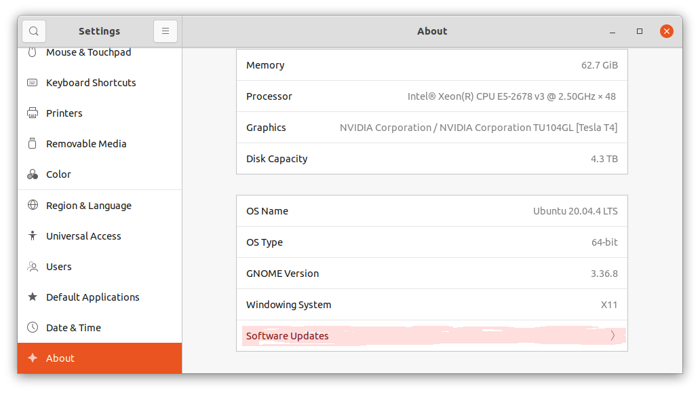
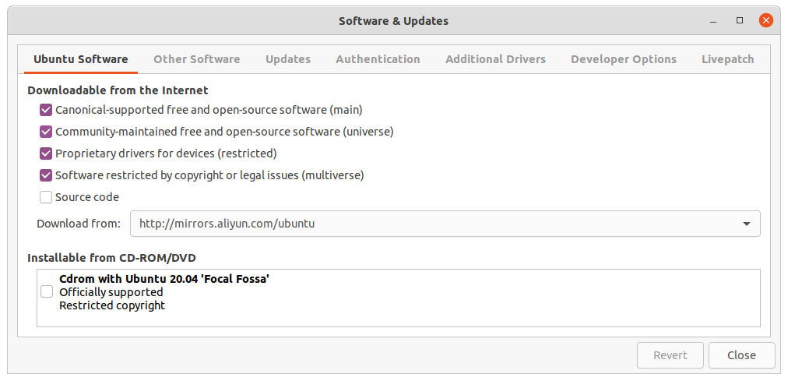

最近发现我的Ubuntu服务器的"Software & Updates"无法打开。网上有各种解决方案，“不幸”的是没一个能起作用，“幸运”的是答案大方向是对的。最终结合一些诊断手段解决了该问题。像这种网上给个大概方向，然后结合自身状况，进一步诊断和解决问题的模式，应该是日常工作中的常态。本文分享一下这个过程。

<!--more--> 

Ubuntu服务器"Software & Updates"无法打开是指：

- 通过应用搜索找到"Software & Updates"或者"Settings->About->Software Updates"（见下图的位置），点击按钮会没有任何反应。



- 如果在"Terminal"里执行`sudo software-properties-gtk`，会有错误信息：

```bash
ERROR:dbus.proxies:Introspect error on :1.239:/: dbus.exceptions.DBusException: org.freedesktop.DBus.Error.NoReply: Message recipient disconnected from message bus without replying
Traceback (most recent call last):
  File "/usr/bin/software-properties-gtk", line 100, in <module>
    app = SoftwarePropertiesGtk(datadir=options.data_dir, options=options, file=file)
  File "/usr/lib/python3/dist-packages/softwareproperties/gtk/SoftwarePropertiesGtk.py", line 222, in __init__
    self.backend.Reload();
  File "/usr/lib/python3/dist-packages/dbus/proxies.py", line 72, in __call__
    return self._proxy_method(*args, **keywords)
  File "/usr/lib/python3/dist-packages/dbus/proxies.py", line 141, in __call__
    return self._connection.call_blocking(self._named_service,
  File "/usr/lib/python3/dist-packages/dbus/connection.py", line 652, in call_blocking
    reply_message = self.send_message_with_reply_and_block(
dbus.exceptions.DBusException: org.freedesktop.DBus.Error.ServiceUnknown: The name :1.239 was not provided by any .service files
```

网上搜索`dbus.exceptions.DBusException: org.freedesktop.DBus.Error.ServiceUnknown`能看到不少相关解答。比如[Ubuntu 18.04 software-properties-gtk failing with org.freedesktop.DBus.Error.ServiceUnknown](https://askubuntu.com/questions/1171211/ubuntu-18-04-software-properties-gtk-failing-with-org-freedesktop-dbus-error-ser)，再比如[Software & Updates won't launch at all](https://askubuntu.com/questions/1294999/software-updates-wont-launch-at-all)，还有[App “Software & Updates” not responding](https://askubuntu.com/questions/1271611/app-software-updates-not-responding)。尝试后，均不能解决我的问题，但是能得到一些确定性的提示：

- `software-properties-gtk`通过系统`dbus`执行
- 通过`sudo journalctl -u dbus -b`可以查看`dbus`日志（注意：`sudo`十分重要，因为查看的是系统服务`dbus`的日志），从而发现导致`software-properties-gtk`失败的原因
- 失败原因是某些`python`包“不正常”导致`software-properties-gtk`找不到`requests_unixsocket`（见如下日志片段）

```bash
Traceback (most recent call last):
  File "/usr/lib/software-properties/software-properties-dbus", line 68, in <module>
    server = SoftwarePropertiesDBus(bus, datadir=datadir)
  File "/lib/python3/dist-packages/softwareproperties/dbus/SoftwarePropertiesDBus.py", line 66, in __init__
    self._livepatch_service = LivepatchService()
  File "/lib/python3/dist-packages/softwareproperties/LivepatchService.py", line 93, in __init__
    self._session = requests_unixsocket.Session()
NameError: name 'requests_unixsocket' is not defined
```

网上答案推荐重新安装相关`python`包，例如：`sudo apt install --reinstall python3-six python3-certifi python3-requests python3-idna`。显然，我的操作系统有问题的包不是这几个，所以操作后依旧不能让`requests-unixsocket`被正常import。根据手上信息，我的目标就很明确了，找到实际损坏的包，重新安装。于是用`sudo vim /lib/python3/dist-packages/softwareproperties/LivepatchService.py`查看这个文件到底是如何import`requests-unixsocket`。发现最开始的地方，尝试`import requests_unixsocket`，而导致失败的异常被`try-except`“吞掉了”。

```python
try:
    import dateutil.parser
    import requests_unixsocket

    gi.require_version('Snapd', '1')
    from gi.repository import Snapd
except(ImportError, ValueError):
    pass
```

于是我直接修改该文件，在`except`捕捉到异常后，打印相关信息

```python
except(ImportError, ValueError):
    import traceback
    print(traceback.format_exc())
```

再次运行`sudo software-properties-gtk`，失败后查看日志，终于发现是因为`urllib3`有问题：

```bash
    import requests_unixsocket
  File "/lib/python3/dist-packages/requests_unixsocket/__init__.py", line 1, in <module>
    import requests
  File "/lib/python3/dist-packages/requests/__init__.py", line 43, in <module>
    import urllib3
ModuleNotFoundError: No module named 'urllib3'
Traceback (most recent call last):
  File "/usr/lib/software-properties/software-properties-dbus", line 68, in <module>
    server = SoftwarePropertiesDBus(bus, datadir=datadir)
  File "/lib/python3/dist-packages/softwareproperties/dbus/SoftwarePropertiesDBus.py", line 66, in __init__
    self._livepatch_service = LivepatchService()
  File "/lib/python3/dist-packages/softwareproperties/LivepatchService.py", line 96, in __init__
    self._session = requests_unixsocket.Session()
NameError: name 'requests_unixsocket' is not defined
```

重新安装`sudo apt install --reinstall python3-urllib3`再运行，这回日志显示`chardet`有问题：

```bash
    import requests_unixsocket
  File "/lib/python3/dist-packages/requests_unixsocket/__init__.py", line 1, in <module>
    import requests
  File "/lib/python3/dist-packages/requests/__init__.py", line 44, in <module>
    import chardet
ModuleNotFoundError: No module named 'chardet'
Traceback (most recent call last):
  File "/usr/lib/software-properties/software-properties-dbus", line 68, in <module>
    server = SoftwarePropertiesDBus(bus, datadir=datadir)
  File "/lib/python3/dist-packages/softwareproperties/dbus/SoftwarePropertiesDBus.py", line 66, in __init__
    self._livepatch_service = LivepatchService()
  File "/lib/python3/dist-packages/softwareproperties/LivepatchService.py", line 96, in __init__
    self._session = requests_unixsocket.Session()
NameError: name 'requests_unixsocket' is not defined
```

继续`sudo apt install --reinstall python3-chardet`，再执行终于看到了期待依旧的窗口：



最后，简要总结一下这个问题解决的两个关键点：

- 通过搜索了解到：`software-properties-gtk`启动失败是由于`python`包有问题
- 通过修改源码，打印`import`导致的异常，找到有问题的`python`包

> **最后的最后：`try-except`没事别吞异常，会导致程序无法运行的异常至少记条日志**。
