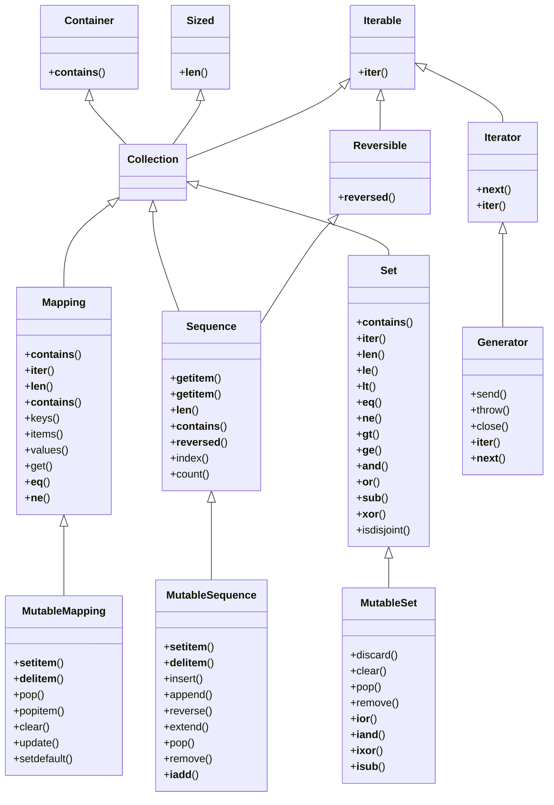

现代编程语言标准库中使用接口、抽象类和具体类来组成**容器和迭代**体系，`Python`也不例外。本文从`Python`容器和迭代的[`Type Hints`](https://peps.python.org/pep-0484/)入手，引出生成器`Generator`，最后介绍“听上去与迭代毫无关联”的协程`Coroutine`是怎么变成生成器`Generator`的“儿子”。

<!--more--> 

## 从`Type Hints`看`Python`的容器和迭代设计

`Python`是动态类型语言，本身没有严格的类型和接口机制。更多的时候是`duck type`：对象身上有使用者需要的方法，那它就是使用者的那只“鸭子”。但在运行时，使用者突然发现手里的货能像鸭子叫，能像鸭子走，但是不能下水，是个旱鸭子，就直接崩掉了。为了避免使用者和制造者对“鸭子”定义不一致引起的麻烦，`Python`通过[PEP 484](https://peps.python.org/pep-0484/)引入`Type Hints`，方便运行前进行各种更严谨的“确认鸭子”流程，确保运行时“鸭子”不会变成“旱鸭子”。

**容器和迭代**是任何编程语言标准库的重要部分。`Python`在`typing`模块（3.9版本开始，该部分类型转移到`collections.abc`模块）中支持了所有抽象容器类。例如：`Iterable`是有`__iter__`方法的基类，基本是可以被遍历的容器类都应该是`Iterable`，比如：`List`，`Dict`等。`__iter__`方法返回一个迭代器`Iterator`。`Iterator`是包含`__next__`和`__iter__`方法，负责具体迭代策略的对象。理论上对`Iterable.__iter__`的每次调用都应该返回全新的迭代器`Iterator`，启动一个重新开始的遍历；`Iterator`本身也有`__iter__`函数，但返回**自身**，即一个已经被使用过（或正在被使用）的迭代器对象实例。

```python
my_iterable = [3, 2, 1]

my_iter_1 = iter(my_iterable)
print(next(my_iter_1))  # 输出3

my_iter_2 = iter(my_iterable)
print(next(my_iter_2))  # 输出3

my_iter_3 = iter(my_iter_2)
print(next(my_iter_3))  # 输出2
```

观察可知，两次在`my_iterable`上执行`iter`会生成两个不相干的新的`Iterator`，所以在每个`my_iter`上执行`next`的输出都是初始值3；而在已经执行过一次`next`的迭代器（`my_iter_2`）上获取`Iterator`迭代器（执行`Iterator.__iter__`），会得到当前迭代器自身（`my_iter_2`），执行`next`会得到2（`my_iter_2`的下一个迭代值）。`Iterable`和`Iterator`的实现通常如下：

```python
from typing import Iterable, Iterator


class MyIterator(Iterator[int]):
    def __init__(self, n: int) -> None:
        super().__init__()
        self._i = n

    def __iter__(self) -> Iterator[int]:
        return self

    def __next__(self) -> int:
        if self._i == 0:
            raise StopIteration()
        self._i -= 1
        return self._i


class MyIterable(Iterable[int]):
    def __init__(self, n: int) -> None:
        super().__init__()
        self._n = n

    def __iter__(self) -> Iterator[int]:
        return MyIterator(self._n)
```

除了`Iterable`能生成`Iterator`之外，`Python`还有另一个迭代生成器`Reversible`，会返回一个逆序的`Iterator`。下图展示了**容器和迭代**体系大部分内容：




## `Generator`

`Generator`是一个“方法”，它的返回值是一个`Iterator`（官方文档称为`Generator Iterator`）。`Generator`很像`__iter__`方法：调用后，不会立刻返回结果，而是返回一个迭代器；在迭代器上执行`next`才会返回一个结果。

```python
def generator():
    yield 3
    yield 2
    yield 1


my_iter_4 = generator()
print(my_iter_4)  # <generator object generator at 0x7f88427bbba0>
print(next(my_iter_4))  # 输出3

my_iter_5 = generator()
print(next(my_iter_5))  # 输出3

my_iter_6 = iter(my_iter_5)
print(next(my_iter_6))  # 输出2
```

执行以上结果，会发现`my_iter_4`，`my_iter_5`和`my_iter_6`的行为和前一节中`Iterator`完全一致。

`Python`还提供`yield from`关键字，支持嵌套生成器（或者叫子生成器）

```python
def child_gen():
    yield 3
    yield 2


def parent_gen_1():   # 没有yield from之前子生成器嵌套使用
    for n in child_gen():
        yield n


def parent_gen_2():   # 有了yield from之后
    yield from child_gen()
```

`Generator`不止是单向返回结果，也支持从调用端接收输入（包含异常和结束信号）

```python
def full_gen(a):
    b = yield a
    c = yield a + b
    yield a + b + c


g = full_gen(1)
print(next(g))  # 激活迭代器到yield a这句，得到返回值1
print(g.send(2))   # 传递b = 2，得到yield a + b = 1 + 2 = 3
print(g.send(3))   # 传递c = 3，得到yield c + a + b = 1 + 2 + 3 = 6
print(g.send(4))   # 没有更多的yield语句，触发StopIteration
```

`send`可以替换`next`，获得下一个`yield`右侧表达式值的同时，将一个值赋给`yield`左侧变量。`throw`和`close`则提供向`Generator`发送异常和终止信号的能力：

```python
def autostart(func):
    def start(*args, **kwargs):
        g = func(*args, **kwargs)
        g.send(None)
        return g
    return start


@autostart
def full_gen():
    try:
        a = yield  # yield右侧没有表达式返回给调用者，只负责从调用端接收数据，这让yield很像`input()`
        print(a)
        b = yield
        print(b)
    except ValueError as e:
        print(str(e))
    except GeneratorExit:
        print("close")
```

为了省去每次显式调用`send(None)`去激活生成器，可以创建一个`decorator`（`autostart`）创建`Generator`之后立刻调用`send(None)`推动脚本执行到第一个`yield`。

```python
g_1 = full_gen()
g_1.send(1)  # 输出1
g_1.throw(ValueError(2))  # 在`Generator`内部抛出ValueError

g_2 = full_gen()
g_2.send(2)  # 输出2
g_2.close()  # 触发`Generator`内部抛出GeneratorExit异常结束
```

我们把`send`，`throw`和`close`放在一起思考，会发现有了这几个操作之后，`Generator`生成器从一个**数据生产者**摇身一变，成了**数据消费者**，整个范式颠倒了！这句话有些复杂，让我们通过代码来解释一下：

```python
def produce():
    yield 3
    yield 2
    raise ValueError(1)


def consume(n):
    print(n)


producer = produce()
for i in producer:
    consume(i)
```

这是`Generator`作为生产者时的流程：

- 通过`yield`将数据生产出来（`yield`右侧表达式）并返回给主流程
- 主流程通过`for`循环读取生产出的数据并消费
- 生产者遇到异常中断或者无法生成更多数据时，主流程终止

```python
def consume():
    while True:
        n = yield
        print(n)


consumer = consume()
consumer.send(3)
consumer.send(2)
consumer.throw(ValueError(1))  # or consumer.close()
```

这是`Generator`作为消费者时的流程：

- 通过`yield`（左侧表达式）从主流程获取数据
- 主流程通过`send`生成数据，并向消费者发送
- 主流程无法生产更多数据或者异常中断，导致消费者一起结束

同样的一个概念可以有两种相反的模式完成同样的功能！是好事还是坏事？

> 两种相反的模式是指：
>
> 1. `Generator`当生产者的时候，消费者通过`for`循环用“拉”模式处理数据
> 2. `Generator`当消费者的时候，消费者通过`React`（`n = yield`）“推”模式等待数据到达


## `Coroutine`

其它一些语言用`async`和`await`来声明协程（包括`Python 3.3+`），我们将这种`Native Coroutine`和`Generator`做个对比，看看为什么`Python`要通过改造`Generator`来实现`Coroutine`。

`async/await`版本：

```python
import asyncio


async def produce():
    await asyncio.sleep(1)
    return "Hello"


async def consume():
    r = await produce()
    print(r)


f_1 = consume()
print(f_1)  # 输出<coroutine object consume at 0x7fb962975140>
asyncio.run(f_1)  # 输出Hello
```

`Generator`版本

```python
def produce():
    sleep(1)
    yield "Hello"


def consume():
    while True:
        n = yield
        print(n)


def run_until_complete():
    p_1 = produce()
    print(p_1)  # <generator object produce at 0x7f0c564bd660>
    
    c_1 = consume()
    print(c_1)  # <generator object consume at 0x7f0c564eb820>
    c_1.send(None)

    while True:
        try:
            n = p_1.send(None)
        except StopIteration:
            c_1.close()
            break
        else:
            c_1.send(n)


run_until_complete()  # 输出Hello
```

的确有些像：

- `async`函数被调用后，返回一个协程，而不会立刻执行；`Generator`函数调用后，返回一个`generator`，也不会立刻执行
- `async`函数会被`asyncio.run`进行触发；`Generator`需要执行`send(XXX)`触发执行
- `await`是在等待其它协程返回；`Generator`的`yield`是在等待调用方返回
- `async`修饰的函数可以通过`await`放弃控制权给`event loop`；`Generator`可以通过`yield`放置控制权给调用方

事实上做一些有技巧的包装，我们完全可以用`Generator`实现`async/await`，请阅读[A Curious Course on Coroutines and Concurrency](http://dabeaz.com/coroutines/Coroutines.pdf)中112页开始的介绍。

坦率的说，我认为`Generator`改出`Coroutine`这出“戏”，是`Python`最ugly的设计之一。一个语法`yield (from)`被用于两种场景，或者（在制造这个混乱的人眼里）`Generator`和`Coroutine`在抽象世界里是协调的，是同一种场景应用（都是执行一段后，交出控制权）。通俗点比喻：信纸（`Generator`）本该用来写信（生成数据），可因为它是纸（主动放弃控制权），所以有人生活取暖（协程）必用信纸（`Generator`）。逻辑上没毛病，但我们真有必要用信纸去生火吗？

还好，`Generator-based Coroutines`在`Python 3.10`中被取消掉。从现在起我们要忘记`yield from`这个制造协程的怪物；请用`async`语法替代所有的`asyncio.coroutine`，用`await`语法替代所有的`yield from`。据说早期用`Generator`表达协程的原因是，[向`Python`中增加新关键字要比重用老关键字复杂很多](https://stackoverflow.com/questions/9708902/in-practice-what-are-the-main-uses-for-the-yield-from-syntax-in-python-3-3)。可到头来还是增加了`async`和`await`关键字，且支持这两个新关键字的[原因](https://peps.python.org/pep-0492/#rationale-and-goals)：

> Current Python supports implementing coroutines via generators (PEP 342), further enhanced by the yield from syntax introduced in PEP 380. This approach has a number of shortcomings:
>
> - It is easy to confuse coroutines with regular generators, since they share the same syntax; this is especially true for new developers.
> - Whether or not a function is a coroutine is determined by a presence of yield or yield from statements in its body, which can lead to unobvious errors when such statements appear in or disappear from function body during refactoring.
> - Support for asynchronous calls is limited to expressions where yield is allowed syntactically, limiting the usefulness of syntactic features, such as with and for statements.

“*It is easy to confuse coroutines with regular generators, since they share the same syntax*”，是不是啪啪打脸？

## 引用

- [1] [PEP 342](https://peps.python.org/pep-0342/)，增加`send`, `close`, `throw`等方法给`Generator`以支持协程
- [2] [PEP 380](https://peps.python.org/pep-0380/)，增加`yield from`以实现`await`效果，等待另一个协程结束
- [3] [PEP 492](https://peps.python.org/pep-0492/)，增加`async`和`await`关键字
- [4] [PEP 544](https://peps.python.org/pep-0544/)，引入`typing.Protocol`支持`Structural subtyping`
- [5] [A Curious Course on Coroutines and Concurrency](http://dabeaz.com/coroutines/Coroutines.pdf)
