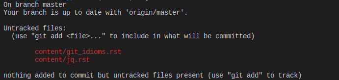
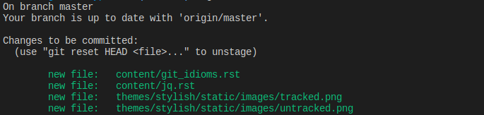
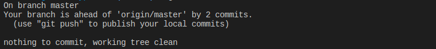
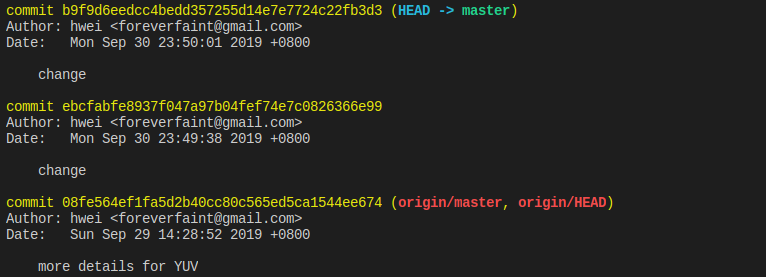
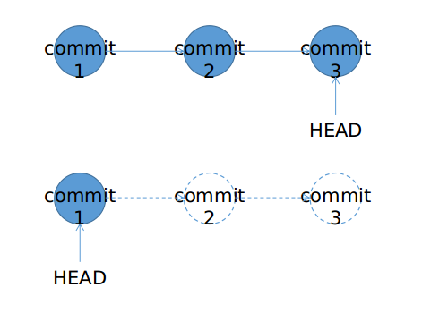
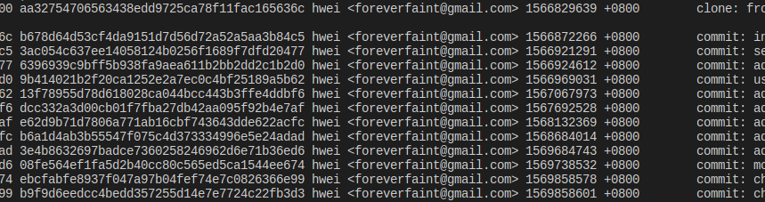
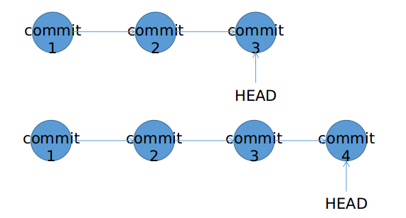

最近观察周围的同事使用git的方式，发现几乎所有人都是git add，git commit，git push, git pull, git merge几个命令打遍天下。

<!--more--> 

最近观察周围同事使用git的方式。发现几乎所有人都是`git add`，`git commit`，`git push`,`git pull`,`git merge`几个命令打遍天下。一方面这几个命令的确已经满足日常工作99%的需求，且越用越熟；另一方面`git revert`，`git reset`，`git rebase`需要了解更多更复杂的机制，同时由于命令很少用，许久不用容易忘记了，一般要现用现查，导致用的越少就越少用，到了最后甚至“躲着”这些命令走。

这几个命令的确需要多了解一些机制，用法也丰富多样。但其实最常用的几个场景还是很套路的。无需全面了解这几个命令，只基于场景记套路，就不容易忘记。本文算是给自己的总结，以备用时查阅。

## 如何回滚一个修改

一共有三种情况：

### 1. 在工作区内的文件修改

执行`git status`，得到如下结果



其中`content/git_idioms.rst`和`content/jq.rst`都是工作区的文件，称为untracked。此时可以执行`git clean -f`，撤销所有修改，所有文件回到本地仓库的版本。也可以通过`git checkout -- <file>`方法撤销某一个文件的修改。但该方法可用的前提是文件已经在暂存区或者仓库中有一个版本用于撤销后的还原点。此处的两个文件，都从未加入过暂存区，也未进入过版本库，故无法使用该方法撤销修改。

### 2. 在暂存区的文件修改 (执行过add命令)

执行`git add .`之后，再次`git status`，得到如下结果



可以使用`git reset HEAD <file>`先将文件从暂存区移动回工作区，然后执行`git checkout -- <file>`撤销修改，撤销后文件恢复到刚进入暂存区的版本。


### 3. 已经进入版本库的文件修改 (执行过commit命令)

执行`git commit -m <comment>`之后，再次`git status`，得到如下结果



此时无论工作区和暂存区都是干净的，修改都已经提交到版本库。此时如果想撤销之前的一个commit，可以使用`git reset`或者`git revert`命令。先简要介绍一下这两个命令的区别。

#### 3.1 git log

无论是`git reset`还是`git revert`都需要指定一个commit id作为参数。而查找commit id都是通过`git log`来完成的。如下图，每一次commit的记录都可以看到。



#### 3.2 git reset

`git reset --hard <commit id>`会将HEAD重置到指定的commit id，该commit id之后的提交都将被撤销。下图表示版本库中一共有三个commit，当前HEAD指向commit 3。执行`git reset --hard commit_1`之后，commit 2和commit 3将被撤销，HEAD指向commit 1。



使用该操作务必慎重。如果你的修改并未push到remote仓库中，该命令可能会让你丢失reset的commit之后的所有改动。

**执行后，突然意识到某些还有用的代码就这么不见了，是不是很抓狂？**幸运的是，本地仓库依旧缓存着刚被`git reset`撤销的commit。找到需要的commit id，可以再次使用`git reset --hard commit_N`找回由于撤销操作丢失的改动。不过commit id不能从`git log`找回。因为此时`git log`返回的是reset之后的log，不再有已经撤销的commit id。要手动从本地日志中找回commit id。

> 注：log数据会在本地保留30天（未经确认）。如需找回被reset掉的commit，请尽快操作。

具体方法（以Ubuntu为例）：在git根目录下，

```bash-session
$ cd .git/logs

$ cat HEAD
```

下图可以看到`cat HEAD`的输出结果包含了所有的commit，找到你需要恢复的commit id即可找回丢失的改动



#### 3.3 git revert

`git revert`针对要撤销的commit，新建一个commit。下图中表示版本库中有三个commit。当撤销commit 2时，通过命令`git revert -n commit_2`创建一个commit 4，并将HEAD指针指到commit 4。



执行`git revert`时，git会使用待撤销commit的前一个commit作为修改内容，这时候需要手动解决冲突。当解决完冲突之后执行`git revert --continue`即可完成撤销工作。此时执行`git log`就会看到一个新增的commit，通常描述文本是 **This reverts commit XXXXXXX** 。