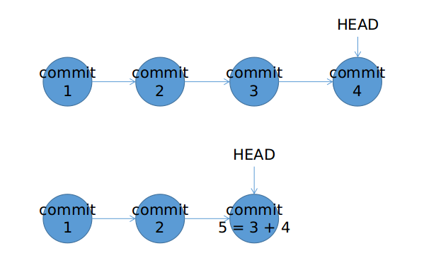
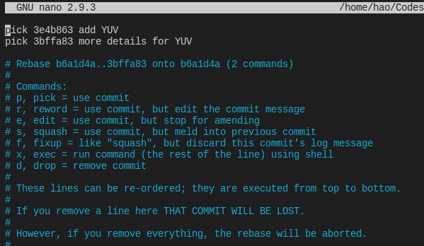
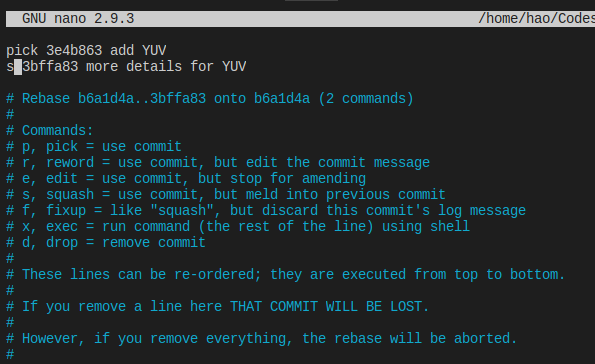
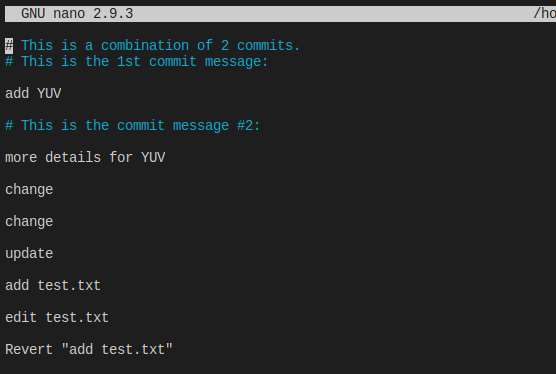
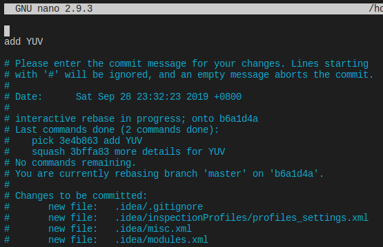
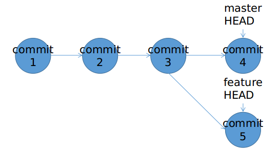
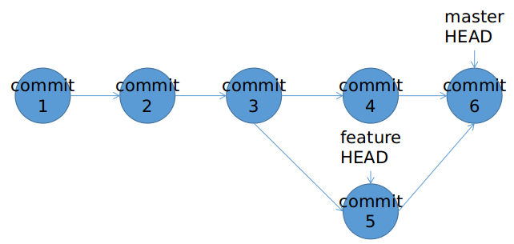
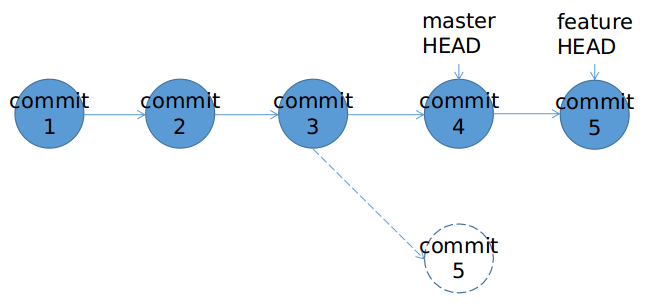

上一篇文章讲了`git revert`和`git reset`。这一篇在记录一下`git rebase`的简单用法。有很多个场景可以使用`git rebase`来更好的提交代码。

<!--more--> 

## 场景1：推送到远程仓库前清理commit

为了实现一个功能，向本地代码库commit了太多次。希望将多次commit合并为一次，避免合并到主仓库后，污染主仓库的commit列表。操作前后，commit history状态如下图：



具体操作过程为如下。可以看到最后2个commit都是有关YUV的内容，但却分成了2个commit。

```bash-session
$ git log --oneline --graph
3bffa83 (HEAD -> master) more details for YUV
3e4b863 add YUV
b6a1d4a add tongji and new article
e62d9b7 add package import article
13f7895 add my own theme
```

如果我们希望将最后2个commit合并成1个commit，可以执行`git rebase -i b6a1d4a`。请注意-i之后跟着的commit id是`git log`中第一个不需要加入rebase的commit id。如果执行命令后，遇到如下提示。说明本地有未提交的修改，请先`git stash`将修改暂存。

```console
$ git rebase -i b6a1d4a
Cannot rebase: Your index contains uncommitted changes.
Please commit or stash them.
```

完成stash之后，重新执行`git rebase -i b6a1d4a`，则会进入文本编辑器用于选择哪些commit需要保留，哪些需要压缩



使用`p`表示该commit需要保留。使用`s`表示该commit要压缩到前一个保留的commit中。故至少要有一个commit被标记为p；且第一个commit（最老的那个commit）必须是p。



保存文件后，会进入commit message修改界面。



需要给rebase后的commit填写一个新的commit message。



如果rebase过程中出现问题，可以执行`git rebase --edit-todo`修改rebase中的错误。修改完毕执行`git rebase --continue`继续完成rebase。完成后执行`git log --oneline --graph`，可以看到`b6a1d4a`commit之前的2个commit被压缩为一个新commit。

```console
$ git log --oneline --graph
689e189 (HEAD -> master) add YUV
b6a1d4a add tongji and new article
e62d9b7 add package import article
13f7895 add my own theme
```

## 场景2：两个分支间的合并

有时候，我们新开分支`feature`进行新功能开发。然后突然接到紧急修复bug的要求，会切换回`master`分支进行修复开发。修复开发结束后，要将分支`feature`合并到`master`中。这个时候因为两个分支的commit历史并不一致，我们需要进行合并。有两个方法

当前commit历史状态



方法1：通过`git merge`操作。完成合并后，在commit历史上会多出一个commit，包含commit 4和commit 5合并后的代码。




方法2：通过`git rebase`操作。在`feature`分支上，执行`git rebase master`将`feature`分支上的改动Replay到master分支上



最后只需切换回`master`分支，执行`git merge feature`即可。可以看到，用第二种方法进行合并，commit历史上更加干净清晰。

## 场景3：两个仓库间的合并

当多人工作在同一个远程仓库，同一分支时，我们向远程仓库提交本地的commit，可能由于本地仓库和远程仓库（其他人在我们最后一次pull之后，提交了代码）的提交历史不一致而失败。这时也可以使用`git rebase`来完成提交历史的合并。本质上这个场景和上一个场景相同，只不过是跨两个仓库完成。
