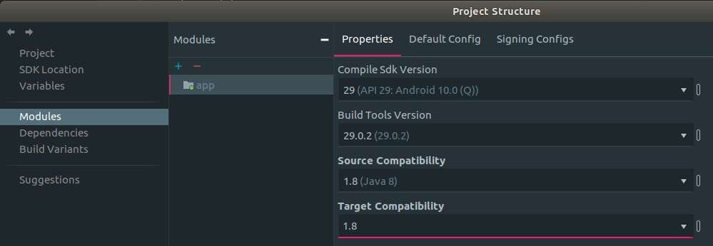

最近在尝试用Kotlin开发Android应用。作为一个Android+Kotlin双小白，开始阶段踩了不少坑，在这里做个记录。

<!--more--> 

小朋友上了小学，体育课增加了跳绳考核。为了达标，在家里经常练习一分钟跳绳。每次都要大人用计时器加人肉计数辅助练习。想想一边盯着手机上的计时器，一边盯着小孩动作计数，就觉得很麻烦。数多了，数少了，是家常便饭。我经常被小朋友吐槽跟不上他的节奏，总是数少了。遂决定开发一个根据声音频率计数且自动倒计时一分钟的Android应用解救家里的大人。

赶时髦用了Kotlin开发Android。学一遍Kotlin语法自不必说。学的过程中，深深感受到Kotlin的野心。Kotlin囊括了所有现代编程语言的特征，语法和语法糖及其丰富。但这也导致，从C++，python，C#/Java一路走来的程序员，感觉太过“啰嗦”。为啥就不引入静态类，非要费劲巴拉的引入Companion类，解决的问题还不是内嵌静态类的那些事情。object真的有必要吗？实现一个单例类能死吗？Java的lambda没有object关键词，不也过得很好？各种内心OS满满的。

今天先撇开槽点，单说说Kotlin+Android Studio开发新手坑。

## ButterKnife

[ButterKnife](http://jakewharton.github.io/butterknife/)使用annotation的方案将layout中的view与Activity中类成员变量bind到一起。网上有大把的使用教程，这里就不从头介绍了。大体上，用起来样子如下：

```kotlin
@BindView(R.id.mStopWatchTextView)
lateinit var mStopWatchTextView: TextView

@BindView(R.id.mRecordButton)
lateinit var mRecordButton: ImageButton

@OnClick(R.id.mRecordButton)
fun onClick(view: View) {
    when (view.tooltipText) {
        this@MainActivity.resources.getString(R.string.start_text) -> start()
        this@MainActivity.resources.getString(R.string.stop_text) -> stop()
        this@MainActivity.resources.getString(R.string.reset_text) -> reset()
    }
}

override fun onCreate(savedInstanceState: Bundle?) {
    super.onCreate(savedInstanceState)
    setContentView(R.layout.activity_main)
}
```

不过运行程序，立刻就会Crash

```bash-session
2019-11-22 22:44:31.645 9672-9672/xyz.dev66.jumpropecounter E/AndroidRuntime: FATAL EXCEPTION: main
    Process: xyz.dev66.jumpropecounter, PID: 9672
    java.lang.RuntimeException: Unable to start activity ComponentInfo{xyz.dev66.jumpropecounter/xyz.dev66.jumpropecounter.MainActivity}: kotlin.UninitializedPropertyAccessException: lateinit property mRecordButton has not been initialized
```

还好这个问题不难，Google一下就见分晓。在onCreate方法中要加个初始化`ButterKnife.bind(this)`：

```kotlin
override fun onCreate(savedInstanceState: Bundle?) {
    super.onCreate(savedInstanceState)
    setContentView(R.layout.activity_main)
    ButterKnife.bind(this)
}
```

## Source Compatibility and Target Compatibility

再次运行程序，依旧Crash。不过错误信息换了

```bash-session
2019-11-22 22:48:26.267 9907-9907/xyz.dev66.jumpropecounter E/AndroidRuntime: FATAL EXCEPTION: main
    Process: xyz.dev66.jumpropecounter, PID: 9907
    java.lang.NoSuchMethodError: No static method metafactory(Ljava/lang/invoke/MethodHandles$Lookup;Ljava/lang/String;Ljava/lang/invoke/MethodType;Ljava/lang/invoke/MethodType;Ljava/lang/invoke/MethodHandle;Ljava/lang/invoke/MethodType;)Ljava/lang/invoke/CallSite; in class Ljava/lang/invoke/LambdaMetafactory; or its super classes (declaration of 'java.lang.invoke.LambdaMetafactory' appears in /apex/com.android.runtime/javalib/core-oj.jar)
        at butterknife.internal.DebouncingOnClickListener.<clinit>(DebouncingOnClickListener.java:12)
        at xyz.dev66.jumpropecounter.MainActivity_ViewBinding.<init>(MainActivity_ViewBinding.java:33)
```

错误提到了DebouncingOnClickListener.java:12这个位置。Kotlin是JVM语言。也就是最终编译为Java运行的一种语言。DebouncingOnClickListener.java这个文件其实就是Kotlin编译为Java的生成文件。打开看一下第12行

```java
private static final Runnable ENABLE_AGAIN = () -> enabled = true;
```

看上去是一个Lambda表达式。而错误提示貌似是Android SDK找不到对应的方法，无法编译。如果Google关键词**java.lang.NoSuchMethodError: No static method metafactory**，只能找到一个包含上述搜索词的文章[Accessing hidden method causes crash · Issue #53 · stripe ...](https://github.com/stripe/stripe-terminal-android/issues/53)。文章是github上的issue，其中有一个人提到了解决方法[issuecomment-520144968](https://github.com/stripe/stripe-terminal-android/issues/53#issuecomment-520144968)，即设置 **sourceCompatibility** 和 **targetCompatibility** 。

```groovy
android {
    compileOptions {
        sourceCompatibility JavaVersion.VERSION_1_8
        targetCompatibility JavaVersion.VERSION_1_8
    }
}
```

然而依旧百思不得其解。过了好几天，突然隐约回忆起有人说过Android SDK对lambda表达式支持的并不好。恍然大悟，Kotlin将一些逻辑转化成了Java的lambda表达式。而默认Android Studio编译时用的Android SDK版本并不能理解lambda表达式。尝试在Android Studio的File -> Project Structure中修改Source Compatibility和Target Compatibility属性到Java SDK 1.8版本：



果然再次运行，顺利启动。