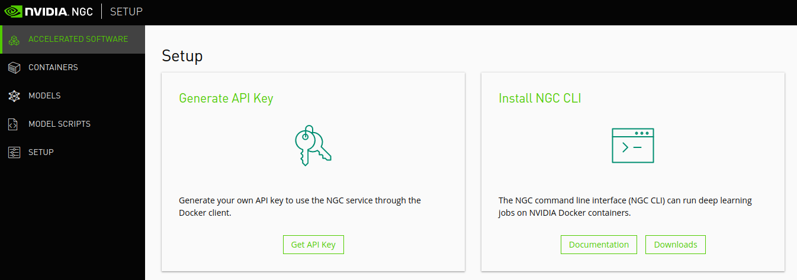
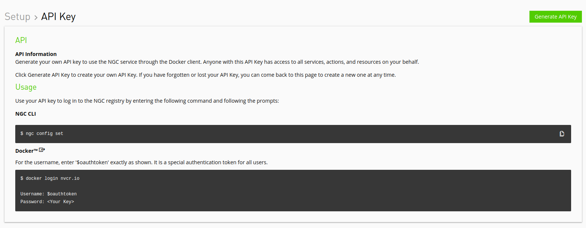

NGC全称为Nvidia GPU Cloud。提供了一组容器镜像，包装了基于GPU的各种软件框架作为运行环境，方便研发和生产使用；同时也提供各种pre-trained的深度学习模型，方便大家学习。

<!--more--> 

Nvidia GPU Cloud（简称NGC）名字里有个**cloud**， 听上去是个IaaS或者PaaS类的产品，类似Azure或者AWS。甚至[NGC官网](https://docs.nvidia.com/ngc/ngc-introduction/index.html)介绍中还包含了**cloud platform**描述。第一次听说这个产品的人，肯定会以为这是Nvidia搭的一个IaaS平台，提供各种GPU服务器的租赁服务。

> NVIDIA GPU Cloud (NGC) is a GPU-accelerated cloud platform optimized for deep learning and scientific computing. In this release, NGC includes NGC containers, the NGC container registry, the NGC website, and platform software for running the deep learning containers. This document provides an overview of the NVIDIA GPU Cloud and how to use it.

然而，通读介绍后就会知道NGC是一个“资源库”，包含：

- NGC Container Registry，容器镜像仓库
- NGC Container，各种深度学习框架镜像，作为开发和生产环境使用
- NGC Websites，浏览/搜索镜像，并管理使用这些镜像的api key
- Model，各种流行的深度学习模型
- NGC Registry CLI，在命令行中浏览/搜索/使用镜像和模型

NGC并不会有什么服务器给你用。你能用的是各种环境镜像以及pre-trained的深度学习模型。

## NGC Container Registry

NGC最重要的功能就是从NGC Container Registry上pull镜像使用。大部分镜像都是无需登录即可pull。有些预览版或者特别要求的镜像需要登录使用。具体方法是要注册一个NGC Website的账号，登录后在Setup页面选择Generate API Key



在Generate API Key页面点击右上角按钮生成一个key。在NGC网站上貌似没有查询当前key的页面，请注意将key保存在其他地方。否则就只能再次生成新的key，所有使用旧key的机器都要重新登录一遍。



拿到key之后，登录到需要pull镜像的服务器完成登录即可。并pull需要的镜像

```bash-session
$ docker login nvcr.io
Username: $oauthtoken
Password: k7cqFTUvKKdiwGsPnWnyQFYGnlAlsCIRmlP67Qxa

$ docker pull nvcr.io/nvidia/caffe:17.04
```

### NGC Registry CLI

NGC Registry CLI是一个CLI工具用于浏览NGC containers，models，model scripts。但是这个cli无法pull containers。pull依旧需要用`docker pull`。登录NGC Website之后，可以按[Setup CLI Install](https://ngc.nvidia.com/setup/installers/cli)完成安装。安装完成后，执行`ngc config set`输入API key等信息完成初始化工作。执行`ngc registry image list`可以看到所有可用的镜像

```bash-session
$ ngc registry image list | jq '.[].displayName'
"BigDFT"
"CANDLE"
"CHROMA"
"GAMESS"
"GROMACS"
"HOOMD-blue"
"kipoi"
"LAMMPS"
"Lattice Microbes"
"Microvolution"
"MILC"
"NAMD"
"Parabricks"
"PGI Compilers"
"PIConGPU"
"QMCPACK"
"RELION"
"vmd"
"DeepStream"
"IndeX"
"ParaView"
"ParaView Holodeck"
"ParaView IndeX"
"ParaView OptiX"
"NVCaffe"
"Caffe2"
"CT Organ Segmentation AI"
"Clara Render Server"
"Clara-Train-SDK"
"Clara Deploy SDK"
"Microsoft Cognitive Toolkit"
"conundrum-aircraftengine-cuda10-pytorch11"
"CUDA"
"CUDA GL"
"DeepStream"
"DeepStream-l4t"
"Smart Parking Detection"
"DIGITS"
"Inference Server"
"CUDA Sample"
"DCGM Exporter"
"Device Plugin"
"Kaldi"
"l4t-base"
"MXNet"
"PyTorch"
"RAPIDS"
"TensorFlow"
"TensorRT"
"TensorRT Inference Server"
"Theano"
"Transfer Learning Toolkit for Video Streaming Analytics"
"Torch"
"Chainer"
"Deep Cognition Studio"
"Dotscience Runner"
"H2O Driverless AI"
"Kinetica"
"OmniSci (MapD)"
"MATLAB"
"OmniSci EE"
"OmniSci Open Source"
"MapR PACC"
"PaddlePaddle"
```

或者`ngc registry model list`输出所有的模型列表

```bash-session
$ ngc registry model list
"BERT-Large (pre-training) for TensorFlow"
"BERT-Large(pre-training using LAMB optimizer) for TensorFlow"
"BERT-Base(fine-tuning) - SQuAD 1.1, seqLen=128"
"BERT-Base(fine-tuning) - SQuAD 1.1, seqLen=384"
"BERT-Base(fine-tuning) - SQuAD 1.1, seqLen=128"
"BERT-Base(fine-tuning) - SQuAD 1.1, seqLen=384"
"BERT-Large(fine-tuning) - SQuAD 1.1, seqLen=128"
"BERT-Large(fine-tuning) - SQuAD 1.1, seqLen=384"
"BERT-Large(fine-tuning) - SQuAD 1.1, seqLen=128"
"BERT-Large(fine-tuning) - SQuAD 1.1, seqLen=384"
"BERT-Base(fine-tuning) - SQuAD 2.0, seqLen=128"
"BERT-Base(fine-tuning) - SQuAD 2.0, seqLen=384"
"BERT-Base(fine-tuning) - SQuAD 2.0, seqLen=128"
"BERT-Base(fine-tuning) - SQuAD 2.0, seqLen=384"
"BERT-Large(fine-tuning) - SQuAD  2.0, seqLen=128"
"BERT-Large(fine-tuning) - SQuAD  2.0, seqLen=384"
"BERT-Large(fine-tuning) - SQuAD 2.0, seqLen=128"
"BERT-Large(fine-tuning) - SQuAD 2.0, seqLen=384"
"BERT-Large(pre-training) for TensorFlow"
"BERT-Large(pre-training using LAMB optimizer) for Pytorch"
"GNMT for PyTorch"
"GNMT for PyTorch"
"GNMT for TensorFlow"
"GNMT for TensorFlow"
"TLT AlexNet Classification"
"TLT GoogLeNet Classification"
"TLT GoogLeNet DetectNet_v2"
"TLT GoogLeNet FasterRCNN"
"TLT Classification with Resnet18."
"TLT MobileNet v1 Classification"
"TLT MobileNet v1 DetectNet_v2"
"TLT MobileNet v1 FasterRCNN"
"TLT MobileNet v2 Classification"
"TLT MobileNet v2 DetectNet_v2"
"TLT MobileNet v2 FasterRCNN"
"TLT ResNet10 Classification"
"TLT Resnet10 DetectNet_v2"
"TLT ResNet10 FasterRCNN"
"TLT ResNet10 SSD"
"TLT ResNet18 Classification"
"TLT ResNet18 DetectNet_v2"
"TLT ResNet18 FasterRCNN"
"TLT ResNet18 SSD"
"TLT ResNet50 Classification"
"TLT ResNet50 DetectNet_v2"
"TLT ResNet50 FasterRCNN"
"TLT SqueezeNet Classification"
"TLT VGG16 Classification"
"TLT VGG16 DetectNet_v2"
"TLT VGG16 FasterRCNN"
"TLT VGG19 Classification"
"TLT VGG19 DetectNet_v2"
"TLT VGG19 FasterRCNN"
"JasperNetDr 10x5 for NeMo"
"Jasper for PyTorch"
"annotation_ct_colon_tumor"
"annotation_ct_hepatic_vessel"
"annotation_ct_liver"
"annotation_ct_liver_tumor"
"annotation_ct_lung_tumor"
"annotation_ct_pancreas"
"annotation_ct_spleen"
"annotation_mri_brain_tumors_t1ce_tc"
"annotation_mri_brain_tumors_t2_wt"
"annotation_mri_hippocampus"
"annotation_mri_left_atrium"
"annotation_mri_prostate_cg_and_pz"
"classification_chest_xray"
"segmentation_ct_colon_tumor"
"segmentation_ct_hepatic_vessel_and_tumor"
"segmentation_ct_liver_and_tumor"
"segmentation_ct_lung_tumor"
"segmentation_ct_pancreas_and_tumor"
"segmentation_ct_spleen"
"segmentation_mri_brain_tumors_br16_full"
"segmentation_mri_brain_tumors_br16_t1c2tc"
"segmentation_mri_hippocampus"
"segmentation_mri_left_atrium"
"segmentation_mri_prostate_cg_and_pz"
"MaskRCNN for PyTorch"
"MaskRCNN for PyTorch"
"pix2pixHD"
"QuartzNet 15x5 for NeMo"
"ResNet v1.5 for MXNet"
"ResNet v1.5 for MXNet"
"ResNet v1.5 for TensorFlow"
"ResNet v1.5 for TensorFlow"
"segmentation_ct_lung_tumor"
"SSD for PyTorch"
"SSD for PyTorch"
"Tacotron2 for PyTorch"
"Tacotron2 for PyTorch"
"TLT Classification with AlexNet"
"TLT Classification with Googlenet."
"TLT Classification with Resnet18."
"TLT Classification with Resnet50."
"TLT Classification with VGG16."
"TLT Classification with VGG19."
"TLT Object Detection with Googlenet."
"TLT Object Detection with Resnet10."
"TLT Object Detection with Resnet18."
"TLT Object Detection with VGG16."
"Transformer-BIG-en-de-8K for NeMo"
"ONNX InceptionV1 TensorRT 5.0.2 T4 FP16"
"ONNX InceptionV1 TensorRT 5.0.2 T4 FP32"
"ONNX InceptionV1 TensorRT 5.0.2 T4 INT8"
"ONNX InceptionV1 TensorRT 5.0.2 V100-16G FP16"
"ONNX InceptionV1 TensorRT 5.0.2 V100-16G FP32"
"ONNX InceptionV1 TensorRT 5.0.2 V100-16G INT8"
"ONNX MobileNetv2_1.0 TensorRT 5.0.2 T4 FP16"
"ONNX MobileNetv2_1.0 TensorRT 5.0.2 T4 FP32"
"ONNX MobileNetv2_1.0 TensorRT 5.0.2 T4 INT8"
"ONNX MobileNetv2_1.0 TensorRT 5.0.2 V100-16G FP16"
"ONNX MobileNetv2_1.0 TensorRT 5.0.2 V100-16G FP32"
"ONNX MobileNetv2_1.0 TensorRT 5.0.2 V100-16G INT8"
"ONNX ResNet50 TensorRT 5.0.2 T4 FP16"
"ONNX ResNet50 TensorRT 5.0.2 T4 FP32"
"ONNX ResNet50 TensorRT 5.0.2 T4 INT8"
"ONNX ResNet50 TensorRT 5.0.2 V100-16G FP16"
"ONNX ResNet50 TensorRT 5.0.2 V100-16G FP32"
"ONNX ResNet50 TensorRT 5.0.2 V100-16G INT8"
"ONNX VGG16 TensorRT 5.0.2 T4 FP16"
"ONNX VGG16 TensorRT 5.0.2 T4 FP32"
"ONNX VGG16 TensorRT 5.0.2 T4 INT8"
"ONNX VGG16 TensorRT 5.0.2 V100-16G FP16"
"ONNX VGG16 TensorRT 5.0.2 V100-16G FP32"
"ONNX VGG16 TensorRT 5.0.2 V100-16G INT8"
"WaveGlow LJS 256 Channels"
"Waveglow for PyTorch"
"Waveglow for PyTorch"
```

也可以下载一个模型到本地

```bash-session
$ ngc registry model download-version nvidia/model/trt_onnx_vgg16_v100_16g_int8:1 -d ./models
```

不过下载镜像依旧要使用`docker pull`或者`nvidia-docker pull`来完成

```bash-session
$ nvidia-docker run nvidia/cuda:10.0-base-centos7 nvidia-smi
Unable to find image 'nvidia/cuda:10.0-base-centos7' locally
10.0-base-centos7: Pulling from nvidia/cuda
d8d02d457314: Pull complete 
6a0ea995a5ea: Pull complete 
dd7361080d9b: Pull complete 
8fa7f021536d: Pull complete 
fb17db70444a: Pull complete 
Digest: sha256:52ac5f3ad6873b5b1276509e0bdfbe107565bf731ab22a960c3c7bf42415d020
Status: Downloaded newer image for nvidia/cuda:10.0-base-centos7
Sun Oct 20 07:24:15 2019       
+-----------------------------------------------------------------------------+
| NVIDIA-SMI 418.87.00    Driver Version: 418.87.00    CUDA Version: 10.1     |
|-------------------------------+----------------------+----------------------+
| GPU  Name        Persistence-M| Bus-Id        Disp.A | Volatile Uncorr. ECC |
| Fan  Temp  Perf  Pwr:Usage/Cap|         Memory-Usage | GPU-Util  Compute M. |
|===============================+======================+======================|
|   0  Tesla P4            On   | 00000000:00:07.0 Off |                    0 |
| N/A   27C    P8     6W /  75W |      0MiB /  7611MiB |      0%      Default |
+-------------------------------+----------------------+----------------------+
                                                                            
+-----------------------------------------------------------------------------+
| Processes:                                                       GPU Memory |
|  GPU       PID   Type   Process name                             Usage      |
|=============================================================================|
|  No running processes found                                                 |
+-----------------------------------------------------------------------------+    
```
