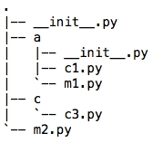
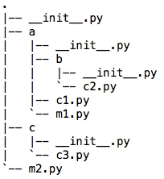
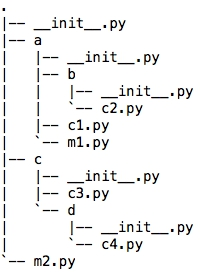
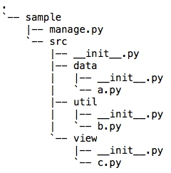

python有[package](https://docs.python.org/2/tutorial/modules.html#packages)和[module](https://docs.python.org/2/tutorial/modules.html)两种概念。package是一个文件夹（包含`__init__.py`文件的文件夹），module是一个文件。module中引用其他package和module时，通过语法`import A`或者`from A import B`完成。import的引用又可以分为绝对引用和相对引用两种：

<!--more--> 

- 绝对引用形如`from A.B import C`　。使用绝对引用，整个包结构更清晰，也较少出现引用找不到的情况。缺点是一旦某个包需要改名，则所有引用它的模块都要进行代码调整。
- 相对引用形如`from .A import C`和`from ..A import C`　。使用相对引用，则无需担忧包改名的问题。但是容易遇到**ValueError: Attempted relative import in non-package**异常。本文会解释一下包引用出错原因和引用跨级包的最佳实践。

假设我们的项目按如下结构组织：



c1.py中定义了

```python
class C1(object):
    def __init__(self):
        pass

    def __str__(self):
        return 'C1'
```

c3.py则定义了

```python
class C3(object):
    def __init__(self):
        pass

    def __str__(self):
        return 'C3'
```

在m1.py中定义代码如下，使用相对引用，引用同级目录下的c1模块

```python
from . import c1
print c1.C1()
```

执行上述代码，会得到错误：

```bash-session
Traceback (most recent call last):
File "/Users/foreverfaint/PycharmProjects/package_import_study/a/m1.py", line 1, in <module>
    from . import c1
ValueError: Attempted relative import in non-package**
```

> 相对引用原则I：在执行模块（m1.py）所在的文件夹，该执行模块被视作顶级模块，并不视作一个包。

故无法用`.`引用当前包。自然，上级文件夹也不视为一个包，无法用`..`引用。正确的实现：

```python
import c1
print c1.C1()
```

如果在文件夹a下再创建一个子文件夹b，同时放c2.py于其中：



此时，我们希望c2.py能引用模块c3.py该如何呢？`..`只能访问父级包，但现在要访问父级包的父级包的子包（好拗口的说法，简单一点说，就是要访问你叔叔的孩子），相对引用应如何写？

> 相对引用原则II：尽量保持相对引用发生在两级以内，如果出现需要跨三级引用的情况，要先用import命令把三级以外的目标包引用到两级以内。

具体解释一下这个原则，由于b中c2.py欲引用c中的c3.py是跨了三级(b->a->c)，故无法直接实现。要先在a包中导入c包中的C3。这样C3就好像是a包的一个模块，c2.py对c3.py的引用就变为了两级（b->a）。代码如下：

a包内的`__init__.py`导入包c中的模块

```python
import c.c3
```

c2.py对C3的使用。注意在c2.py中直接用c.c3引用C3即可，因为此时c.c3包中的全部内容已经在a包中

```python
import c.c3

class C2(object):
    def __init__(self):
        pass

    def __str__(self):
        return 'C2'

print c.c3.C3()
```

如果更复杂一点，出现了跨四级引用，如下结构:



要想在c2.py中引用c4.py该如何做？我们只要心中牢记**原则II**，想法设法把多级“拍成”两级即可。

首先在c包中的`__init__.py`，添加如下代码，将d包中的c4导入c包中（4级变为了3级）。

```python
from d import c4
```

在a包中的`__init__.py`，添加如下代码导入c3, c4到a包中（3级又变为了2级）。

```python
from c import c3, c4
```

现在就可以在c2.py中引用C4了（2级内的相对引用）。

```python
from c import c4

class C2(object):
    def __init__(self):
        pass

    def __str__(self):
        return 'C2'

print c4.C4()
```

最后要说的是，尽管我们可以通过反复使用**原则II**，来完成跨级相对引用。但是为了避免把包引用搞得太复杂引入不必要的麻烦，在设计包结构时应该尽量简单，最好在两级之内。一个通用且合理的包结构如下：



1. package是项目根目录，但并不是一个包。
2. 包从src开始。只有两级包，第二级分别是data，util和view。
3. 第二级包之间可以完全通过`..`来完成相互引用
4. 执行模块永远在根目录下（这里是manage.py），无需使用相对引用，可以直接import导入任何需要运行的模块。