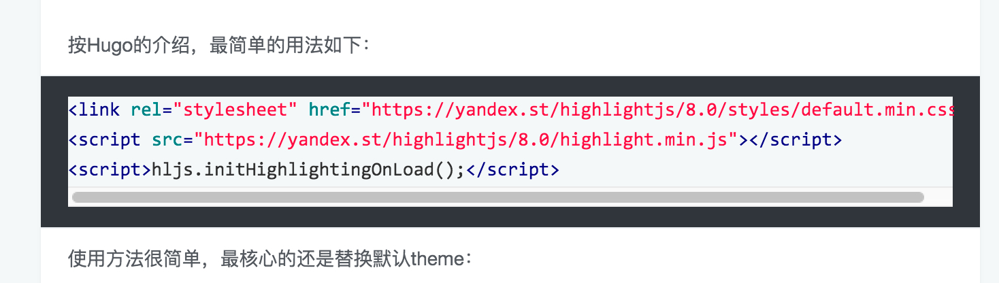
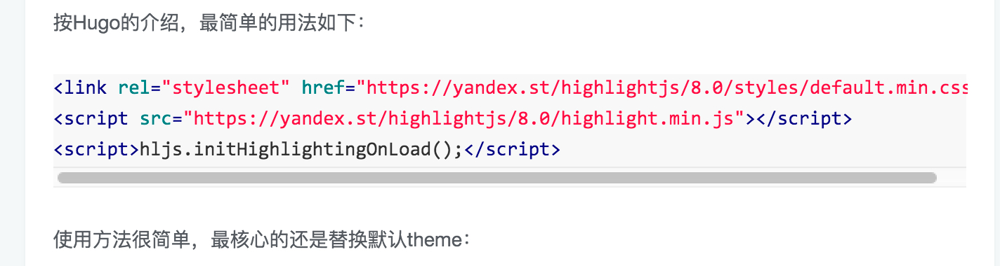

[Hugo](http://gohugo.io)是Go语言实现的静态网页生成器，常用来创建和管理博客。写技术博客，在页面中渲染代码是必不可少的需求。Hugo可以支持Server和Client两种方法进行代码的[语法高亮处理](http://gohugo.io/extras/highlighting/#highlight-js-example:c4210b265c792cac9a6cf6a5f53b671d)：

> Update@2022 当前版本的Hugo已经使用`Go`内置的[`Chroma`](https://github.com/alecthomas/chroma)进行语法高亮处理。但是以下的旧方案依旧可以使用。

<!--more--> 

## Server方案

使用[Pygments](http://pygments.org/)在`.md`文件通过Hugo的[shortcodes](https://gohugo.io/content-management/shortcodes/)加入代码。Hugo引擎编译时将其转化为对应的HTML代码。在这里谈两个关于Pygments的使用经验：

1. Pygments安装后自带一些theme。查看有哪些theme的方法看[这里](http://pygments.org/docs/styles/#getting-a-list-of-available-styles)
2. 如果使用独立css文件实现theme，已有theme列表看[这里](https://github.com/richleland/pygments-css)

## Client方案

使用[highlightjs](https://highlightjs.org)在浏览器中进行实时渲染，而在.md文件中直接使用markdown的标准方式“三个`“ 方式来加入代码。

最简单用法如下：

```html
<link rel="stylesheet" href="https://yandex.st/highlightjs/8.0/styles/default.min.css">
<script src="https://yandex.st/highlightjs/8.0/highlight.min.js"></script>
<script>hljs.initHighlightingOnLoad();</script>
```

使用方法很简单，最核心的还是替换默认theme：

- highlightjs的theme列表在[官网Demo](https://highlightjs.org/static/demo/)中可以找到。
- 如果不想把theme的css下载到本地，推荐使用[cdnjs](https://cdnjs.com/libraries/highlight.js#)，最新版本9.0的highlightjs所需文件在上面很全
- 替换theme，只需替换上面代码中第一行css为theme对应的css即可

最后关于highlightjs使用中的一个坑是：Hugo本身有很多theme。每个theme对代码段渲染的基本原理相同，都是把代码渲染到pre code中，或者增加highlight class到div上。然而有些theme会画蛇添足的在pre code或者highlight上定义背景色、边框等各种样式，干扰了highlightjs本身的正常渲染效果。比如：[hugo-icarus-theme](http://themes.gohugo.io/hugo-icarus/)这个Hugo theme会在它的style.css中定义:

```css
.article-entry pre,
.article-entry .highlight {
    background: #34383d;
    margin: 0 -20px;
    padding: 15px 20px;
    border-style: solid;
    border-color: #eceff2;
    border-width: 1px 0;
    overflow: auto;
    color: #ccc;
    line-height: 22.400000000000002px;
}
.article-entry code {
    background: #f5f8f9;
    text-shadow: 0 1px #fff;
    padding: 0 0.3em;
}
```

导致无论选择哪种highlightjs的theme，渲染后背景都是`#34383d`，同时有个很ugly的外边框（如下图）



这个只有修改theme的css

```css
.article-entry pre,
.article-entry .highlight {
    margin: 0 -20px;
    padding: 15px 20px;
    overflow: auto;
    color: #ccc;
    line-height: 22.400000000000002px;
}
.article-entry code {
    text-shadow: 0 1px #fff;
    padding: 0 0.3em;
}
```

修改后的效果

