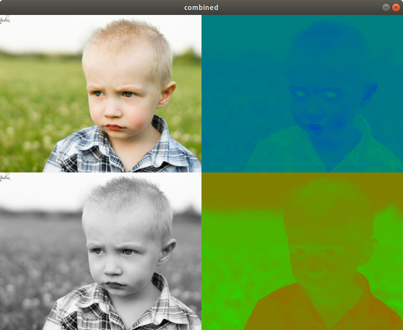
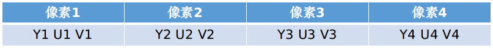
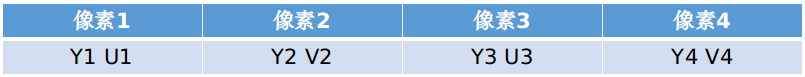
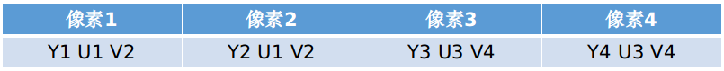
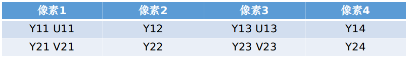
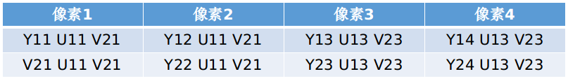

[YUV](https://en.wikipedia.org/wiki/YUV)和RGB一样，是一种色彩编码方案。其中Y称为亮度（Luminance），U和V称为色度（Chrominance），描述影像色彩及饱和度。YUV的出现是为了兼容黑白电视，即在灰度信号（Y）之上，增加UV信号。这样及时电视台发送彩色的YUV图像，黑白电视依旧可以用Y，按黑白视频播出。

<!--more--> 

## RGB和YUV的关系

首先这里提到的RGB是指[Linear RGB](https://en.wikipedia.org/wiki/RGB_color_model)，非[sRGB](https://en.wikipedia.org/wiki/SRGB>)。分量的值域是0.0到1.0。Y是RGB中部分的叠加，U是RGB中蓝色部分和亮度的差异，V是RGB中红色部分和亮度的差异。故RGB和YUV转换如下：

```
Y = 0.299 × R + 0.587 × G + 0.114 × B
U = -0.147 × R - 0.289 × G + 0.436 × B = 0.492 × (B - Y)
V = 0.615 × R - 0.515 × G - 0.100 × B = 0.877 × (R- Y)

R = Y + 1.140 × V
G = Y - 0.394 × U - 0.581 × V
B = Y + 2.032 × U
```

为了能更直观的感受Y，U，V三个分量所表达的含义，我们用一段代码将各分量剥离出来显示。

首先，加载测试图片，先将RGB转为YUV，然后再将YUV分解为三个通道保存到`vector`中。注意使用[split](https://docs.opencv.org/2.4/modules/core/doc/operations_on_arrays.html?highlight=split#cv2.split)将YUV的每个通道转为一张灰度图像

```c
Mat rgbImage = imread("test.jpg"); 

Mat yuvImage; 
cvtColor(rgbImage, yuvImage, COLOR_RGB2YUV);  

std::vector<Mat> yuvMatParts(yuvImage.channels());  
split(yuvImage, yuvMatParts);
```

为了将不同通道渲染到屏幕展示，还需要将灰度图再转为BGR。但Y，U，V三通道转为BGR的方法并不相同。`yuvMatParts`第1个元素为Y通道灰度图，代表亮度。因为灰度和亮度是等价的，只需直接将灰度图转为BGR即可（BGR每个通道都复制一遍Y通道的像素值）

```c
Mat yImage;
cvtColor(yuvMatParts[0], yImage, COLOR_GRAY2BGR);
```

U通道不是亮度，而是代表绿色和蓝色分量的部分。`yuvMatParts` 第2个元素为U通道。通道中每一个像素并不代表灰度（亮度），而是索引值（值域为0到255）。需要在256个BGR值构成的数组中，取对应的BGR值。这个技术在opencv中称为[`LUT（Look Up Table）](https://docs.opencv.org/2.4/modules/core/doc/operations_on_arrays.html#lut)。使用 `LUT`函数将通道映射为BGR。具体操作，先将U通道灰度转为BGR三通道图

```c
Mat uImage;
cvtColor(yuvMatParts[1], uImage, COLOR_GRAY2BGR);
```

生成一个U8（灰度值）到U8C3（BGR三通道值）的LUT。U通道是绿色和蓝色分量，故LUT中，红色值为0，蓝色和绿色分别通过索引值i进行计算得到

```c
void buildLUTForGreenBlue(uchar uData[])
{
    for (int i = 0; i<256; i++)
    {
        uData[i * 3] = i;  
        uData[i * 3 + 1] = 255 - i;  
        uData[i * 3 + 2] = 0; 
    }
}
```

将LUT应用到已经转为BGR图的U通道上

```c
uchar uData[256 * 3];
buildLUTu(uData);
Mat buildLUTForGreenBlue(1, 256, CV_8UC3, uData);

Mat greenBlueImage;
LUT(uImage, greenBlueLUT, greenBlueImage); 
```

V通道代表绿色和红色分量。生成对应LUT的代码。

```c
void buildLUTGreenRed(uchar data[])
{
    for (int i = 0; i<256; i++)
    {
        data[i * 3] = 0;  
        data[i * 3 + 1] = 255 - i;  
        data[i * 3 + 2] = i; 
    }
}
```

当所有通道都映射为BGR图之后，用`hconcat`和`vconcat`函数将图拼接在一起渲染出来。完整的代码如下：

```c
#include <opencv2/opencv.hpp> 
#include <opencv2/imgproc/imgproc.hpp> // vconcat
#include <opencv2/highgui/highgui.hpp> // LUT

using namespace cv;
using namespace std;

void buildLUTForGreenBlue(uchar data[])
{
    for (int i = 0; i<256; i++)
    {
        data[i * 3] = i;  
        data[i * 3 + 1] = 255 - i;  
        data[i * 3 + 2] = 0; 
    }
}

void buildLUTGreenRed(uchar data[])
{
    for (int i = 0; i<256; i++)
    {
        data[i * 3] = 0;  
        data[i * 3 + 1] = 255 - i;  
        data[i * 3 + 2] = i; 
    }
}

// g++ yuv.c -o yuv `pkg-config --cflags --libs opencv4` 
int main(int argc, char** argv) 
{ 
    // 请替换为你本地的图片
    cv::Mat rgbImage = imread("/home/hao/Pictures/general/18485655.548e015727c8e.jpg"); 

    // 将RGB图像转为YUV格式图像
    cv::Mat yuvImage; 
    cvtColor(rgbImage, yuvImage, cv::COLOR_RGB2YUV);  

    std::vector<cv::Mat> yuvMatParts(yuvImage.channels());  
    split(yuvImage, yuvMatParts);    

    Mat yImage;
    cvtColor(yuvMatParts[0], yImage, cv::COLOR_GRAY2BGR);

    Mat uImage;
    cvtColor(yuvMatParts[1], uImage, cv::COLOR_GRAY2BGR);

    uchar uData[256 * 3];
    buildLUTForGreenBlue(uData);
    Mat greenBlueLUT(1, 256, CV_8UC3, uData);

    Mat greenBlueImage;
    cv::LUT(uImage, greenBlueLUT, greenBlueImage);

    Mat vImage;
    cvtColor(yuvMatParts[2], vImage, cv::COLOR_GRAY2BGR);

    uchar vData[256 * 3];
    buildLUTGreenRed(vData);
    Mat greenRedLUT(1, 256, CV_8UC3, vData);

    Mat greenRedImage;
    cv::LUT(vImage, greenRedLUT, greenRedImage);

    // 以下将四幅图渲染到一起展示
    Mat vCombinedImage1;
    vconcat(rgbImage, yImage, vCombinedImage1);

    Mat vCombinedImage2;
    vconcat(greenBlueImage, greenRedImage, vCombinedImage2);
    
    Mat combinedImage;
    hconcat(vCombinedImage1, vCombinedImage2, combinedImage);

    cv::imshow("combined", combinedImage);
    cv::waitKey();
    cv::destroyWindow("combined");

    return 0; 
}
```

运行代码后，会展示四幅图：左上角为原图，左下角为Y通道图（即亮度图），右上角U通道（即蓝色分量图），右下角为Y通道（即红色分量图）：



## YUV和YCrCb的关系

还有一个格式会经常提到YCrCb。YUV或者Y'UV常用语模拟信号，YCrCb指数字信号。但两者本质一样，YCrCb与YUV相比只是略有偏移。目前在计算机图像领域，所有基于YCrCb格式压缩的图片都可叫为YUV格式。

```
Y = 0.257 × R + 0.504 × G + 0.098 × B + 16
Cb = -0.148 × R - 0.291 × G + 0.439 × B + 128
Cr = 0.439 × R - 0.368 × G - 0.071 × B + 128

R = 1.164 × (Y’-16) + 1.596 × (Cr-128)
G = 1.164 × (Y’-16) - 0.813 × (Cr-128) - 0.392 × (Cb-128)
B = 1.164 × (Y’-16) + 2.017 × (Cb-128)
```

## YUV压缩方案

YUV和RGB类似，使用24 bits来表示一个像素点，即Y，U，V分别用8 bits代表。人眼对相邻像素点（左右或者上下）的亮度很敏感，但对色彩的细微变化却不敏感。故可以通过采样方法，保留Y值，但抛弃一些U和V，实现压缩的目的。具体来说YUV有多种格式，例如：YUV444，YUV422，YUV420等。

### YUV444

YUV以4个像素为一组进行采样。4:4:4表示所有4个像素都提取YUV三个值，即不采样格式。每个像素为24 bits。



### YUV422

4:2:2表示4个像素都采集Y值，但只有两个像素采集U值，另两个像素采集V值。每个像素只需要16 bits。

内存中存储如下：



解码后：



### YUV420

4:2:0表示4个像素都采集Y值，但只有两个像素采集U值，下一行同样位置的两个像素采集V值。这样平均每个像素12 bits。

内存中存储如下：



解码后：


